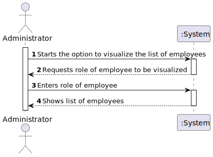
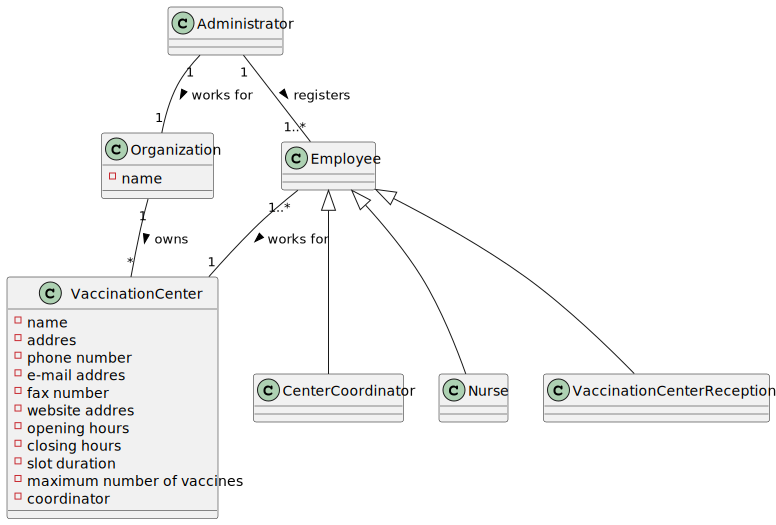
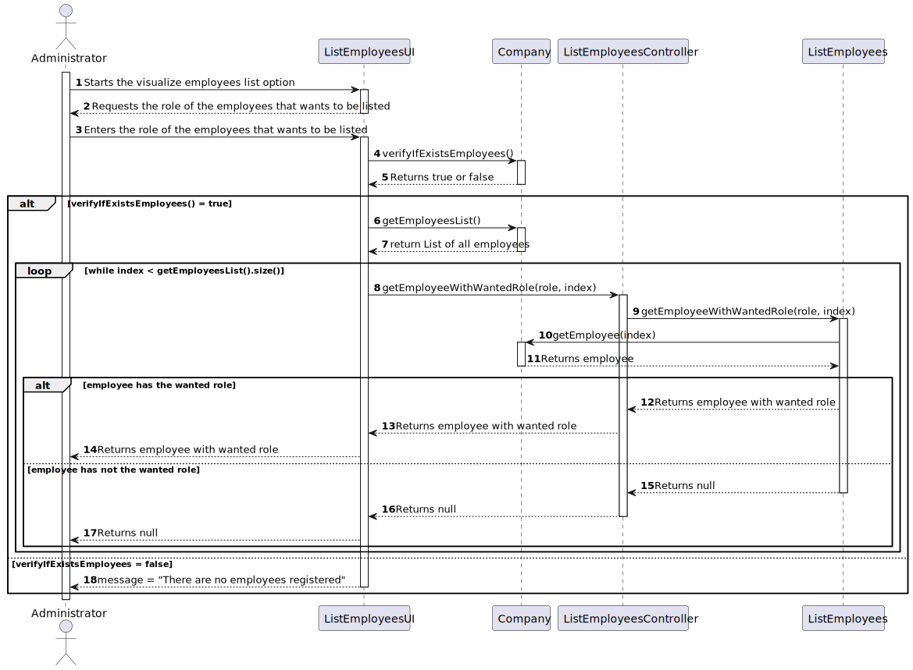
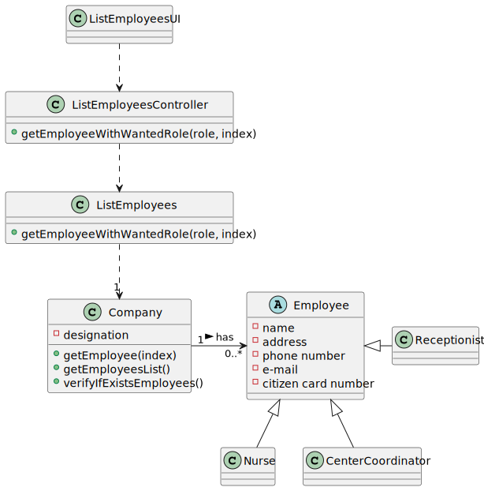

 # US 11 - Get a list of employees with a certain role

## 1. Requirements Engineering

### 1.1. User Story Description

*As an administrator, I want to get a list of Employees with a given function/role.*

### 1.2. Customer Specifications and Clarifications 

From the client's clarifications:
* The Administrator must select the employees' role to be listed(link for the clarification: https://moodle.isep.ipp.pt/mod/forum/discuss.php?d=15711);
* All employees' attributes must be listed (name, address, phone number, email and citizen card number) (link for the clarification: https://moodle.isep.ipp.pt/mod/forum/discuss.php?d=16007);
* For now, the order of presentation of the list is not relevant(link for the clarification: https://moodle.isep.ipp.pt/mod/forum/discuss.php?d=15711);

### 1.3. Acceptance Criteria

n/a

### 1.4. Found out Dependencies

*US11 depends on US10, since it needs that an employee is registred, with its role/function, so that it can be listed.*

### 1.5 Input and Output Data
***Input data:***
* Role

***Output:*** 
* A list with each employee's data that have the wanted role

### 1.6. System Sequence Diagram (SSD)

### 1.7 Other Relevant Remarks

n/a

## 2. OO Analysis

### 2.1. Relevant Domain Model Excerpt 

### 2.2. Other Remarks
n/a

## 3. Design - User Story Realization 

### 3.1. Rationale

| Interaction ID                                               | Question: Which class is responsible for... | Answer          | Justification (with patterns)                            |
|:-------------------------------------------------------------|:--------------------------------------------|:----------------|:---------------------------------------------------------|
| Step 1: Starts the option to visualize the list of employees | Listing the employees                       | ListEmployeeUI  | Creator:R1/2                                             |
| Step 2: Requests role of employee to be visualized           | Requesting the input data                   | n/a             |                                                          |
| Step 3: Enters role of employee                              | Selecting the right employees               | ListEmployee    | Can access the employees data and is a specific function |
| Step 4: Shows list of employees                              | Showing the list of employees               | ListEmployeesUI | Responsible for user interaction                         |

### Systematization ##

According to the taken rationale, the conceptual classes promoted to software classes are: 

 * ListEmployees
 * Company
 * Employee
 * Nurse
 * Receptionist
 * CenterCoordinator

Other software classes (i.e. Pure Fabrication) identified: 
 * ListEmployeesUI  
 * ListEmployeesController

## 3.2. Sequence Diagram (SD)

## 3.3. Class Diagram (CD)

# 4. Tests 

**Test 1: tests if the method getEmployee returns the right employee.**

	@Test
    void verifyIfExistsEmployeesFalse() {
        boolean expected = false;
        assertEquals(expected, Company.verifyIfExistsEmployees());
    }

# 5. Construction (Implementation)

## Class Company
    public static Employee getEmployee(int role, int index){
        Employee employee = null;
        switch (role){
            case 1:
                if (employees.get(index) instanceof Nurse){
                employee = employees.get(index);
                }
                break;
            case 2:
                if (employees.get(index) instanceof Receptionist){
                    employee = employees.get(index);
                }
                break;
            case 3:
                if (employees.get(index) instanceof CenterCoordinator){
                    employee = employees.get(index);
                }
                break;
        }
        return employee;
    }

## Class ListEmployees

    public static List<Employee> listEmployeesWithWantedRole(int role){
        for (int index = 0; index < Company.getEmployeesList().size(); index++) {
            employeesList.add(Company.getEmployee(role, index));
        }
        return employeesList;
    }

# 6. Integration and Demo 

 * A new option on the Admin menu was added

# 7. Observations

n/a