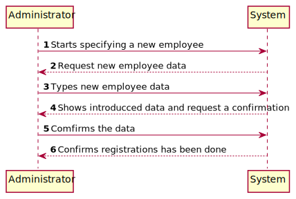
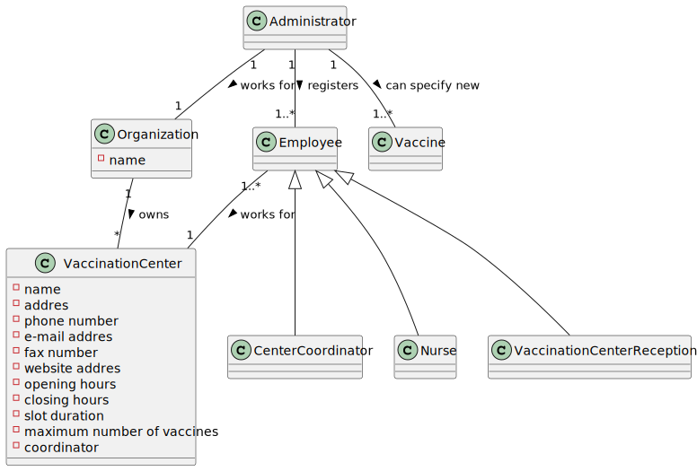
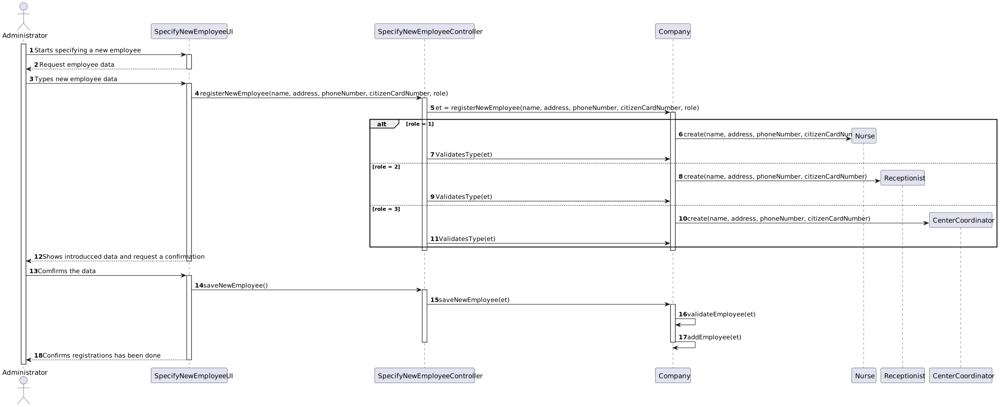
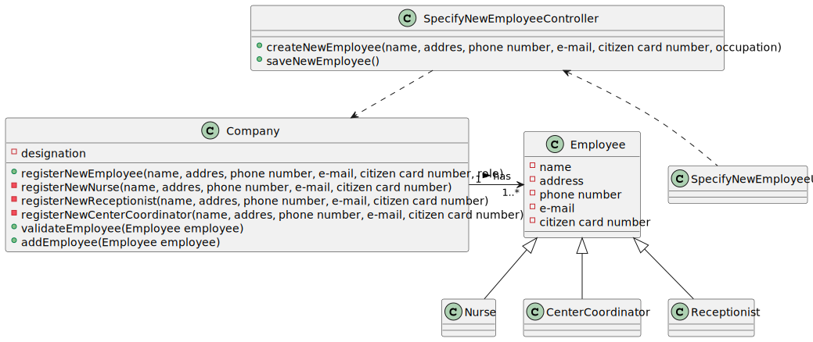

# US 010 - Register an employee

## 1. Requirements Engineering

### 1.1. User Story Description

*"As an administrator, I want to register an Employee."*

### 1.2. Customer Specifications and Clarifications 

* Every employee has only one role
* All employee atributes are mandatory (name ,address, phone number, e-mail and citizen card number)

### 1.3. Acceptance Criteria

*Each user must have a single role defined in the system. The "auth" component available on the repository must be reused (without modifications)*

### 1.4. Found out Dependencies

*No dependencies were found*

### 1.5 Input and Output Data

***Input data:***

* Name
* Address
* Phone number
* E-mail
* Citizen card number

***Output data:***

* Confirmation that the nem employee has been registered.

### 1.6. System Sequence Diagram (SSD)

### 1.7 Other Relevant Remarks

* none

## 2. OO Analysis

### 2.1. Relevant Domain Model Excerpt 
*In this section, it is suggested to present an excerpt of the domain model that is seen as relevant to fulfill this requirement.* 

### 2.2. Other Remarks

*n/a*

## 3. Design - User Story Realization 

### 3.1. Rationale

**The rationale grounds on the SSD interactions and the identified input/output data.**

| Interaction ID                                                | Question: Which class is responsible for... | Answer                    | Justification (with patterns)                 |
|:--------------------------------------------------------------|:--------------------------------------------|:--------------------------|:----------------------------------------------|
| Step 1: Starts specifying a new employee 		                   | Instancing a new employee                   | VaccinationCenter 							 | Creator:R1/2                                  |
| Step 2: Request new employee data		                           | Request the input data							               | n/a                       |                                               |
| Step 3: Types new employee data		                             | Saving the inptut data							               | Employee                  | The objet created in step 1 has its own data. |
| Step 4: Shows introducced data and request a confirmation  		 | Validating the data locally 							         | Employee                  | Knows its own data.                           |
|                                                               | Validating the data globally                | Organization              | Knoemployee type objects.                     |
| Step 5: Comfirms the data  		                                 | Saving the new registered employee  							 | Organization              | Records all the employee type objects.        |
| Step 6: Comfirms registration has been done  		               | Comfirm operation success 							           | SpecifyNewEmployeeUI      | Responsible for user interaction.             |              

### Systematization ##

According to the taken rationale, the conceptual classes promoted to software classes are: 

* Organization
* Employee
* Nurse
* Receptionist
* CenterCoordinator

Other software classes (i.e. Pure Fabrication) identified: 

 * SpecifyNewEmployeeUI
 * SpecifyNewEmployeeController

## 3.2. Sequence Diagram (SD)

*In this section, it is suggested to present an UML dynamic view stating the sequence of domain related software objects' interactions that allows to fulfill the requirement.* 

## 3.3. Class Diagram (CD)

*In this section, it is suggested to present an UML static view representing the main domain related software classes that are involved in fulfilling the requirement as well as and their relations, attributes and methods.*

# 4. Tests 

**Test 1:** Check that it is not possible to create an instance of the Example class with null values. 

    void validateNoNullCreation() {
        Nurse nu = new Nurse(null, null, 0, null, 0);
        boolean actual = Company.validateEmployee(nu);
        assertFalse(actual);
    }

# 5. Construction (Implementation)

##Employee class

    public Employee registerNewEmployee(String name, String address, int phoneNumber, String email, int citizenCardNumber, int role){
        Employee employee = null;
        if (role == 1) {
            employee = registerNewNurse(name, address, phoneNumber, email, citizenCardNumber);
        } else if (role == 2) {
            employee = registerNewReceptionist(name, address, phoneNumber, email, citizenCardNumber);
        } else if (role == 3) {
            employee = registerNewCoordinator(name, address, phoneNumber, email, citizenCardNumber);
        }
        return employee;
    }

In the case of a nurse:

    private static Employee registerNewNurse(String name, String address, int phoneNumber, String email, int citizenCardNumber) {
        return new Nurse(name, address, phoneNumber, email, citizenCardNumber);
    }

# 6. Integration and Demo

* New option on the admin menu added.

# 7. Observations

