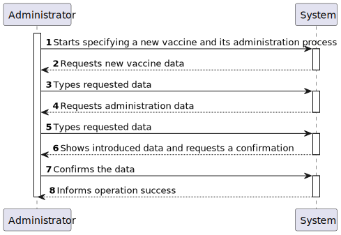
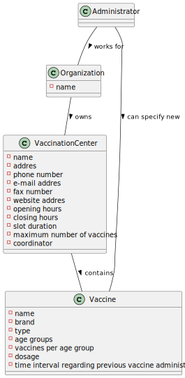
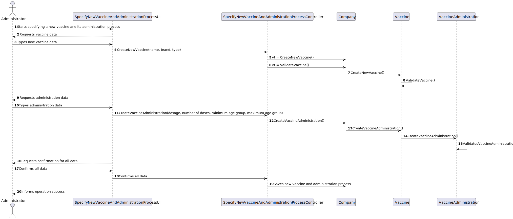
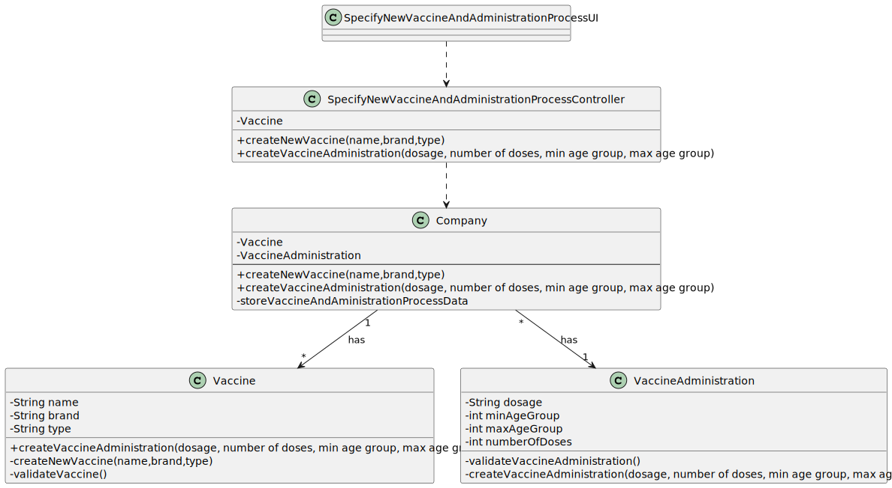

# US 13 - Specify a new vaccine and its administration process

## 1. Requirements Engineering

### 1.1. User Story Description

"As an Administrator, I intend to specify a new vaccine and its administration process."

### 1.2. Customer Specifications and Clarifications 

 **From the specifications document:**

 * "[...] for the Covid-19 type, there is (i) the
   Pfizer vaccine, (ii) the Moderna vaccine, (iii) the Astra Zeneca vaccine, and so on."

 * "The vaccine
   administration process comprises (i) one or more age groups (e.g.: 5 to 12 years old, 13 to 18 years
   old, greater than 18 years old), and (ii) per age group, the doses to be administered (e.g.: 1, 2, 3), the
   vaccine dosage (e.g.: 30 ml), and the time interval regarding the previously administered dose."

 * "[...]  it is important to notice that between doses (e.g.: between the 1st and 2nd doses) the
   dosage to be administered might vary as well as the time interval elapsing between two consecutive
   doses (e.g.: between the 1st and 2nd doses 21 days might be required, while between the 2nd and the
   3rd doses 6 months might be required)."

* "An Administrator is responsible for properly configuring and managing the core information (e.g.:
  type of vaccines, vaccines, vaccination centers, employees) required for this application to be
  operated daily by SNS users, nurses, receptionists[...]"

### 1.3. Acceptance Criteria

n/a

### 1.4. Found out Dependencies

No dependencies were found.

### 1.5 Input and Output Data

**Input Data:**

* Vaccine type
* Vaccine name
* Vaccine brand
* Vaccine dosage
* Age group
* Number of doses

**Output Data:**

* Confirmation of the creation of a new vaccine

### 1.6. System Sequence Diagram (SSD)

### 1.7 Other Relevant Remarks

n/a

## 2. OO Analysis

### 2.1. Relevant Domain Model Excerpt 

### 2.2. Other Remarks

n/a

## 3. Design - User Story Realization 

### 3.1. Rationale

**The rationale grounds on the SSD interactions and the identified input/output data.**

| Interaction ID                                                         | Question: Which class is responsible for...                      | Answer                                      | Justification (with patterns)                                        |
|:-----------------------------------------------------------------------|:-----------------------------------------------------------------|:--------------------------------------------|:---------------------------------------------------------------------|
| Step 1: Starts specifying a new vaccine and its administration process | Instancing a new vaccine	                                        | Vaccine                                     | Creator: R1/2                                                        |
|                                                                        | Instancing its administration process                            | VaccineAdministration                       | Creator: R1/2                                                        |
| Step 2: Requests new vaccine data                                      | Requesting the input data	                                       | SpecifyNewVaccineAndAdministrationProcessUI |                                                                      |
| Step 3: Types requested data                                           | Saving the input data 	                                          | Administrator                               | The objet created in step 1 has its own data.                        |
| Step 4: Request administration data                                    | Requesting the input data                                        | SpecifyNewVaccineAndAdministrationProcessUI |                                                                      |
| Step 5: Types requested data                                           | Saving the input data                                            | Administrator                               | The objet created in step 1 has its own data.                        |
| Step 6: Shows introduced data and requests a confirmation              | Validating the data locally	                                     | Administrator                               | IE: knows its own data.                                              |
|                                                                        | Validating the data globally                                     | Company                                     | IE: knows all the Vaccine and VaccineAdministration objects          |
| Step 7: Confirms the data                                              | Saving the new registered vaccine and its administration process | Company                                     | IE: adopts/records all the Vaccine and VaccineAdministration objects |
| Step 8: Informs operation success                                      | Confirming operation success                                     | SpecifyNewVaccineAndAdministrationProcessUI | IE: responsible for user interaction                                 |              

### Systematization ##

According to the taken rationale, the conceptual classes promoted to software classes are: 

 * Vaccine
 * Company
 * VaccineAdministration

Other software classes (i.e. Pure Fabrication) identified: 
 * SpecifyNewVaccineAndAdministrationProcessUI  
 * SpecifyNewVaccineAndAdministrationProcessController

## 3.2. Sequence Diagram (SD)

## 3.3. Class Diagram (CD)

# 4. Tests 

**Test 1:** Check that it is not possible to create an instance of the Example class with null values. 

	@Test
    void validateVaccine() {
        Vaccine vaccine = new Vaccine(null,null,null,null,0,0,0);
        boolean expected = false;
        assertEquals(expected,company.validateVaccine(vaccine));
    }

# 5. Construction (Implementation)

## Class validateVaccine
    public boolean validateVaccine (Vaccine vc) {
        if (vc.getName() != null && vc.getBrand() != null && vc.getType() != null && vc.getDosage() != null && vc.getMinAgeGroup() > 0 && vc.getMaxAgeGroup() > 0 && vc.getNumberOfDoses() > 0) {
            if (vc == null)
                return false;
            return !this.vaccines.contains(vc);
        } else {
            return false;
        }
    }

# 6. Integration and Demo 

A new option on the Admin menu was added

# 7. Observations

n/a

