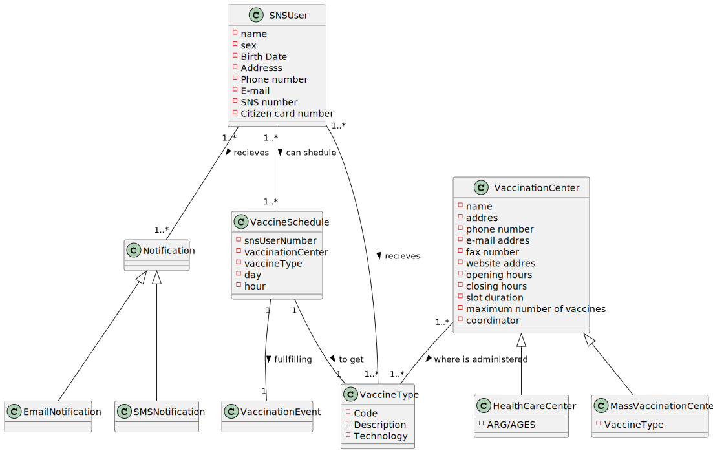
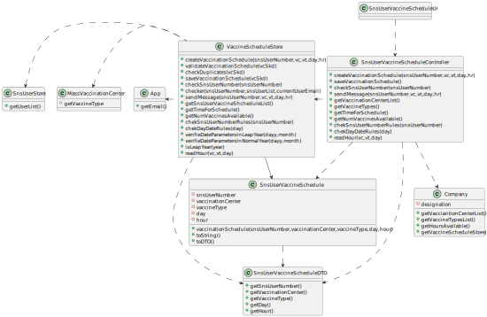

# US 001 - Schedule a vaccine as a SNS user

## 1. Requirements Engineering

### 1.1. User Story Description

*As an SNS user, I intend to use the application to schedule a vaccine.*

### 1.2. Customer Specifications and Clarifications 

* "[...] the SNS user should use the application to schedule his/her vaccination. The user
   should introduce his/her SNS user number, select the vaccination center, the date, and the time (s)he
   wants to be vaccinated as well as the type of vaccine to be administered (by default, the system
   suggests the one related to the ongoing outbreak)" *
* "[...] thee vaccination center capacity for that day/time and, if possible, confirm that the vaccination is
  scheduled and inform the user that (s)he should be at the selected vaccination center at the
  scheduled day and time" *
* "The SNS user may also authorize the DGS to send a SMS message with
  information about the scheduled appointment." *
* "If the user authorizes the sending of the SMS, the
  application should send an SMS message when the vaccination event is scheduled and registered in
  the system" *

### 1.3. Acceptance Criteria

* **AC1:** A SNS user cannot schedule the same vaccine more than once.

### 1.4. Found out Dependencies

* There is a dependence with "US9-Register a Vaccination Center", because to schedule a vaccine is required a Vaccination Center.
* There is a dependence with "US12-specify a new vaccine type", because to schedule a vaccine is required to specify the vaccine type wanted.
* There is a dependence with "US13-specify a new vaccine and its administration process", because to schedule a vaccine is required to specify the vaccine wanted and before schedule other dosage if necessary.
* There is a dependence with "US14- load a set of users", because is necessary a list of user that are registered on the app.

### 1.5 Input and Output Data

* Typed data:
    * SNS user number
    * the date

* Selected data:
    * vaccination center
    * the time (s)he wants to be vaccinated
    *type of vaccine to be administered

**Output Data:**

* (In)Success of the operation
* Confirms the vaccination is scheduled 

### 1.6. System Sequence Diagram (SSD)

### 1.7 Other Relevant Remarks

* * 

## 2. OO Analysis

### 2.1. Relevant Domain Model Excerpt 
 

### 2.2. Other Remarks

**n/a** 

## 3. Design - User Story Realization 

### 3.1. Rationale

**The rationale grounds on the SSD interactions and the identified input/output data.**

| Interaction ID | Question: Which class is responsible for... | Answer  | Justification (with patterns)  |
|:-------------  |:--------------------- |:------------|:---------------------------- |
| Step 1: starts scheduling a vaccine  		                                |...instantiating a new Vaccination Schedule?	      | VaccineScheduleStore                              | Creator:R1/2                              |
|    		                                                                |...interacting with the actor?				          | SnsUserVaccineScheduleUI             | Pure Fabricator: there is no reason to assign this responsibility to any existing class in the Domain Model.                              |
|    		                                                                |...coordinating the US?				              | SnsUserVaccineScheduleController     | Controller                              |
| Step 2: request data (SnsUserNumber)  		                            | n/a							                      |                                      |                                 |
| Step 3: types the requested data  		                                |...saving the input data?							  | SnsUserVaccineSchedule               | IE: The String input in step 1 has it own data                              |
| Step 4: Show the data and request a confirmation  	                    |...validating data locally?			              | SnsUserVaccineSchedule               | IE: Knows it own data                            |
|    		                                                                |...validating data globally?				          | VaccineScheduleStore                 | IE: Knows the data from all Sns Users                            |
| Step 5: Confirms the data  		                                        |...saving the start of user Vaccination Schedule 	  | VaccineScheduleStore                 | IE: Have records from all Sns Users                            |
| Step 6: Show a list of Vaccination Center available  		                |...knowing the list of Vaccination Centers?		  | Company                              | IE: The list of Vaccination Centers are defined on Company                                |
| Step 7: Select a Vaccination Center  		                                |...saving the inputted data?				          | SnsUserVaccineSchedule               | IE: Object created as it own data                            |              
| Step 8: Show a list of Vaccine Type available  		                    |...knowing the list of Vaccine types?                | Company                              | IE: The list of vaccine types are defined on Company                                |
| Step 9: Select a Vaccine Type  		                                    |...saving the inputted data?			              | SnsUserVaccineSchedule               | IE: Object created as it own data                              |
| Step 10: request data (day)  		                                        |n/a		                                          |                                      |                                                                |
| Step 11: types the requested data  		                                |...saving the input data?							  | SnsUserVaccineSchedule               | IE: The String input in step 1 has it own data                              |
| Step 12: Show the data and request a confirmation  	                    |...validating data locally?			              | SnsUserVaccineSchedule               | IE: Knows it own data                            |
|    		                                                                |...validating data globally?				          | VaccineScheduleStore                 | IE: Knows the data from all days available                            |
| Step 13: Confirms the data  		                                        | 	                                                  |                            |                            |
| Step 14: Show the hours available to schedule the vaccine  		        |...knowing the list of available hours?              | VaccineScheduleStore                 | IE: The list of available hours are defined on VaccineScheduleStore                               |  
| Step 15: Select an hour  	                               	                |...saving the inputted data?					      | SnsUserVaccineSchedule               | IE: Object created as it own data                              |  
| Step 16: Shows the data and requests a confirmation  		                | n/a					    	                      |                                      |                                 |  
| Step 17: Confirms the data  		                                        |...validating the data locally?		              | SnsUserVaccineSchedule               | IE: The object created has it own data                             |  
|    		                                                                |...validating data globally?				          | VaccineScheduleStore                 | IE: Knows it own data                            |
|    		                                                                |...saving the created Vaccination Schedule?	      | VaccineScheduleStore                 | IE: Knows the data from all Vaccination Schedules                             |
| Step 18: Ask the user to receive a sms whit schedule data information  	| n/a	                                              |                                      |                                 |  
| Step 19: Types the answer(yes/no) 		                                |...save the answer?					              | SnsUserVaccineScheduleUI             | IE: Responsible for user interaction                              |  
|    		                                                                |...Send the message?      	                          | VaccineScheduleStore                 | IE: Knows the data from the Vaccination Schedule                             |
| Step 20: Confirms operation success  		                                |...informing operation success?				      | SnsUserVaccineScheduleUI             | IE: Responsible for user interaction                            |  

### Systematization ##

According to the taken rationale, the conceptual classes promoted to software classes are: 

 * Company
 * SnsUserVaccineSchedule

Other software classes (i.e. Pure Fabrication) identified: 
 * SnsUserVaccineScheduleUI  
 * SnsUserVaccineScheduleController

## 3.2. Sequence Diagram (SD)

** 

## 3.3. Class Diagram (CD)

**

# 4. Tests 
*In this section, it is suggested to systematize how the tests were designed to allow a correct measurement of requirements fulfilling.* 

**_DO NOT COPY ALL DEVELOPED TESTS HERE_**

**Test 1:** Check that it is not possible to create an instance OF Sns User Vaccine Schedule with null value. 

	@Test
    void validateVaccinationScheduleNullParameter() {
        SnsUserVaccineSchedule vcSkd = null;
        boolean actual = store.validateVaccinationSchedule(vcSkd);
        assertFalse(actual);
    }

**Test 2:** Check if is possible to schedule the same vaccine type more than once-AC1.

	@Test
    void checkDuplicatesDuplicates() {
        List<SnsUserVaccineSchedule> SnsUserVaccineShcheduleList = store.getSnsUserVaccineShcheduleList();
        SnsUserVaccineShcheduleList.add(vcSkd1);
        SnsUserVaccineSchedule vcSkd2 = new SnsUserVaccineSchedule(snsUserNumber,vc2,vcSkd1.toDto().getVaccineType(), day1,hr1);
        boolean expected = store.checkDuplicates(vcSkd2);
        assertFalse(expected);
    }

**Test 3:** Check that it is not possible to set the day of vaccine schedule in a wrong format.

	@Test
    void chekDayDateRulesInvalidNoBars() {
        assertThrows(IllegalArgumentException.class,
                () -> {
                    store.chekDayDateRules("26082022");
                });
    }

*It is also recommended to organize this content by subsections.* 

# 5. Construction (Implementation)
 - **Class SnsUserVaccineScheduleController** 
     
       public class SnsUserVaccineScheduleController {
       private VaccineScheduleStore store;
       private Company company;
       private SnsUserVaccineSchedule vcSkd;

       public SnsUserVaccineScheduleController() {
       this(App.getInstance().getCompany());
       }

       public SnsUserVaccineScheduleController(Company company) {
       this.company = company;
       this.store = company.getVaccineScheduleStore();
       this.vcSkd = null;
       }

       public boolean createVaccinationSchedule(int snsUserNumber, VaccinationCenter vc, VaccineType vt, String day, String hr) {
       this.vcSkd = this.store.createVaccinationSchedule(snsUserNumber, vc, vt, day, hr);
       return this.store.validateVaccinationSchedule(vcSkd);
       }

       public boolean saveVaccinationSchedule() {

       return this.store.saveVaccinationSchedule(vcSkd);
       }

- **Class SnsUserVaccineSchedule**

       public class SnsUserVaccineSchedule {
       /**
       * The Sns User Number
       */
       private int snsUserNumber;
       /**
       * The Vaccination Center of Vaccine Schedule
       */
       private VaccinationCenter vaccinationCenter;
       /**
       * The Vaccine Type of Vaccine Schedule
       */
       private VaccineType vaccineType;
       /**
       * The day of Vaccine Schedule
       */
       private String day;
       /**
       * The hour of Vaccine Schedule
       */
       private String hour;

       /** Builds a Sns User Vaccine Schedule instance
       * @param snsUserNumber
       * @param vaccinationCenter
       * @param vaccineType
       * @param day
       * @param hour
       */
       public SnsUserVaccineSchedule(int snsUserNumber, VaccinationCenter vaccinationCenter, VaccineType vaccineType, String day, String hour) {
       this.snsUserNumber = snsUserNumber;
       this.vaccinationCenter = vaccinationCenter;
       this.vaccineType = vaccineType;
       this.day = day;
       this.hour = hour;
       }

       /**
       * @return SnsUserVaccineSchedule String whit SnsUserNumber, Vaccination Center name, Vaccine Type description, day and hour
       */
       public String toString() {
       return "VacinneSchedule{" +
       "SnsUser Number='" + snsUserNumber + '\'' +
       ", Vaccination Center='" + vaccinationCenter.getName() + '\'' +
       ", Vaccine Type='" + vaccineType.getDescription() + '\'' +
       ", Day='" + day + '\'' +
       ", Hour='" + hour + '\'' +
       '}'+"\n";

       }

# 6. Integration and Demo 

- New menu created for Sns User
- A new option was added for Sns User menu

*In this section, it is suggested to describe the efforts made to integrate this functionality with the other features of the system.*

# 7. Observations

*In this section, it is suggested to present a critical perspective on the developed work, pointing, for example, to other alternatives and or future related work.*

