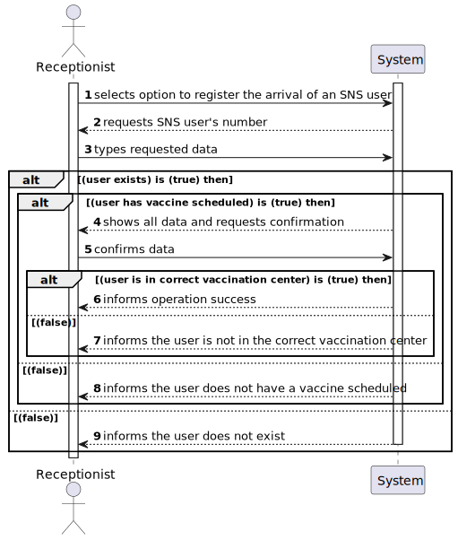
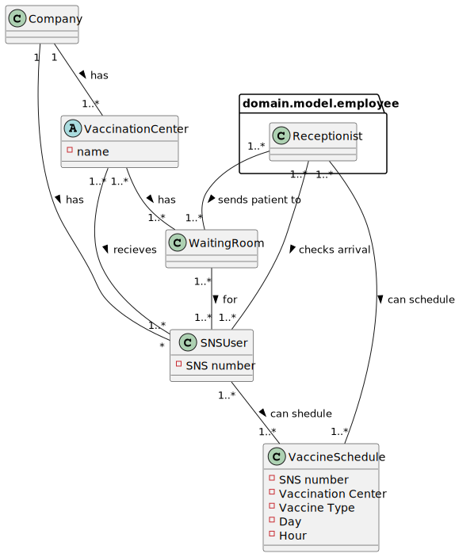
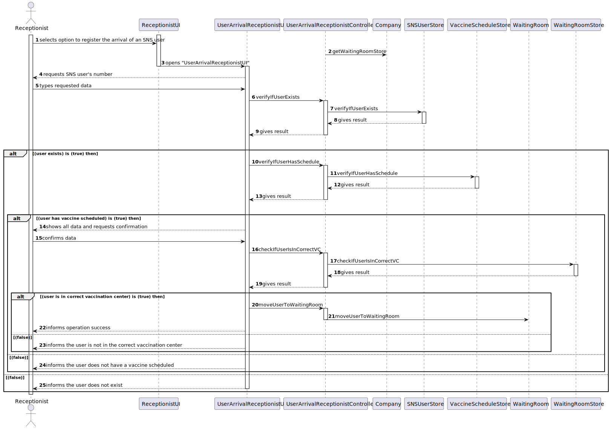
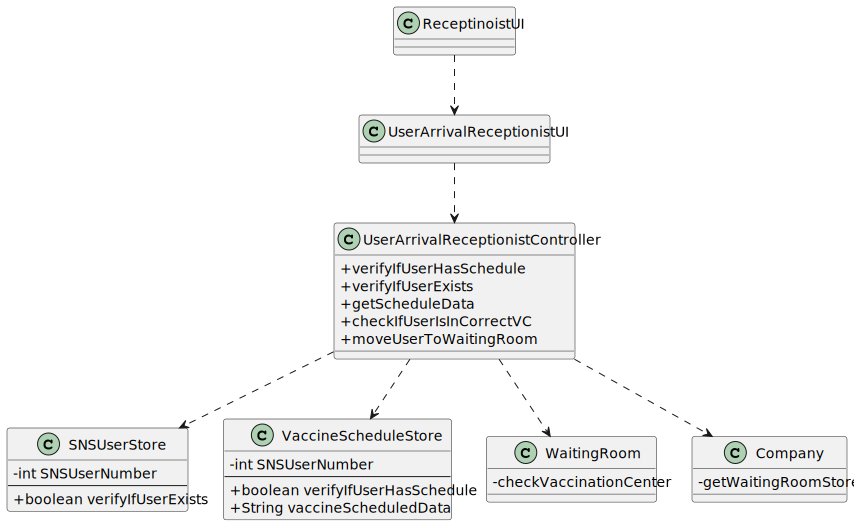

# US 004 - Register the arrival of an SNS user to take the vaccine

## 1. Requirements Engineering

### 1.1. User Story Description

* As a receptionist at a vaccination center, I want to register the arrival of a SNS user
to take the vaccine.

### 1.2. Customer Specifications and Clarifications 

**From the specifications document:**
* "When the SNS user arrives at the vaccination center, a receptionist registers the arrival of the user to
  take the respective vaccine. The receptionist asks the SNS user for his/her SNS user number and
  confirms that he/she has the vaccine scheduled for the that day and time. If the information is
  correct, the receptionist acknowledges the system that the user is ready to take the vaccine. Then,
  the receptionist should send the SNS user to a waiting room where (s)he should wait for his/her
  time."

### 1.3. Acceptance Criteria

* No duplicate entries should be possible for the same SNS
  user on the same day or vaccine period.

### 1.4. Found out Dependencies

* US4 depends on the US14 to get the users details from the database.
* US4 depends on the US1 to get the vaccination scheduled by the user.

### 1.5 Input and Output Data

**Input data :**

* SNS user number

**Output data :**

* Confirms the user is ready to take the vaccine
* Informs operation success

### 1.6. System Sequence Diagram (SSD)

### 1.7 Other Relevant Remarks

n/a
## 2. OO Analysis

### 2.1. Relevant Domain Model Excerpt 

### 2.2. Other Remarks

n/a

## 3. Design - User Story Realization 

### 3.1. Rationale

| Interaction ID                                                       | Question: Which class is responsible for...                        | Answer                                                 | Justification (with patterns)                                                                                |
|:---------------------------------------------------------------------|:-------------------------------------------------------------------|:-------------------------------------------------------|:-------------------------------------------------------------------------------------------------------------|
| Step 1: selects option to register the arrival of an SNS user 		     | selecting the option to register the arrival of an SNS user        | ReceptionistUI                                         | Pure Fabricator: there is no reason to assign this responsibility to any existing class in the Domain Model. |
|                                                                      | coordinating the US                                                | UserArrivalReceptionistController                      | Controller                                                                                                   | 
| Step 2: requests SNS user's number 		                                | n/a							                                                         |                                                        |                                                                                                              |
| Step 3: types requested data 		                                      | saving the input data                                              | UserArrivalReceptionistUI                              | IE: The String input in step 1 has it own data                                                               |
| Step 4: shows all data and requests confirmation 		                  | validating the data			                                             | VaccineScheduleStore / SNSUserStore | IE: Knows the data from all Sns Users                                                                        |
| Step 5: confirms data 		                                             | saving the data				                                                | Company / WaitingRoom                                  | IE: Object created as it own data                                                                            |
| Step 6: informs operation success 		                                 | informing operation success                                        | UserArrivalReceptionistUI                              | IE: Responsible for user interaction                                                                         |              
| Step 7: informs the user is not in the correct vaccination center 		 | informing that the user is not in the correct vaccination center		 | UserArrivalReceptionistUI                              | IE: Responsible for user interaction                                                                         |
| Step 8: informs the user does not have a vaccine scheduled 		        | informing that the user does not have a vaccine scheduled			       | UserArrivalReceptionistUI                              | IE: Responsible for user interaction                                                                         |
| Step 9: informs the user does not exist 		                           | informing that the user does not exist			                          | UserArrivalReceptionistUI                              | IE: Responsible for user interaction                                                                         |

### Systematization ##

According to the taken rationale, the conceptual classes promoted to software classes are:

 * WaitingRoom
 * Company

Other software classes (i.e. Pure Fabrication) identified: 

 * ReceptionistUI
 * UserArrivalReceptionistUI
 * UserArrivalReceptionistController
 * SNSUserStore
 * VaccineScheduleStore

## 3.2. Sequence Diagram (SD)

## 3.3. Class Diagram (CD)

# 4. Tests 

**Test 1:** Check if the user and vaccination center validation methods work.

	@Test
    void addToWaitingRoom() {
        CenterCoordinator cc1 =new CenterCoordinator("Ana","Casa da Ana",927641959,"ana@gmail.com",12345678);
        VaccineType vt1 = new VaccineType("qwert","Covid","mRNA");
        SNSUser user = new SNSUser("João","Masculine","28/4/2002","Paredes",123456789,"joao@gmail.com",892375901,83472195);
        MassVaccinationCenter vc1 = new MassVaccinationCenter("CentroTeste1","Rua do CentroTeste1","987321654","centroteste1@gmail.com","1234567890","www.centroteste1.com","8:00","16:00",5,5,cc1,vt1);
        assertTrue(WaitingRoom.addToWaitingRoom(vc1, user));
    }

# 5. Construction (Implementation)

- **Class UserArrivalReceptionistController**

    public boolean verifyIfUserHasSchedule(int snsUserNumber) {
      boolean schedule = false;
      for (SnsUserVaccineSchedule c : list) {
        if (c.toDto().getSnsUserNumber() == snsUserNumber) {
          schedule = true;
        }
      }
    return schedule;
    }

    public boolean verifyIfUserExists(int snsUserNumber) {
        if (snsUserStore.getUserBySNSNumber(snsUserNumber) == null) {
            return false;
        }
        return true;
    }

    public String getScheduleData(int snsUserNumber) {
        String vaccineScheduleData = "";
        for (SnsUserVaccineSchedule c : list) {
            if (c.toDto().getSnsUserNumber() == snsUserNumber) {
                vaccineScheduleData = c.toString();
            }
        }
        return vaccineScheduleData;
    }

    public boolean checkIfUserIsInCorrectVC(VaccinationCenter vaccinationCenter, int snsUserNumber) {
        return waitingRoomStore.checkVaccinationCenter(vaccinationCenter, snsUserNumber);
    }

    public boolean moveUserToWaitingRoom(VaccinationCenter vaccinationCenter,SNSUser snsUser) {
        return WaitingRoom.addToWaitingRoom(vaccinationCenter, snsUser);
    }

# 6. Integration and Demo 

A new option on the ReceptionistUI menu was added.

# 7. Observations

n/a

