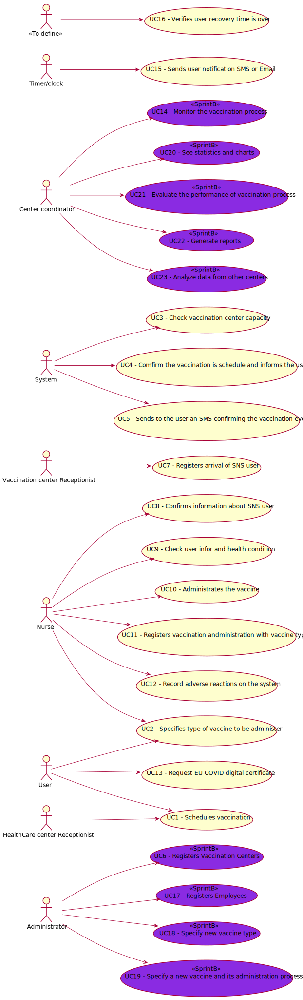

# Use Case Diagram (UCD)

**In the scope of this project, there is a direct relationship of _1 to 1_ between Use Cases (UC) and User Stories (US).**

However, be aware, this is a pedagogical simplification. On further projects and curricular units might also exist _1 to N **and/or** N to 1 relationships between US and UC.

**Insert below the Use Case Diagram in a SVG format**

**For each UC/US, it must be provided evidences of applying main activities of the software development process (requirements, analysis, design, tests and code). Gather those evidences on a separate file for each UC/US and set up a link as suggested below.**

# Use Cases / User Stories
| UC/US  | Description                  |                   
|:-------|:-----------------------------|
| US 001 | [ShortNameOfUS001](US1.md) |
| US 002 | [ShortNameOfUS002](US2.md) |
| US 003 | [ShortNameOfUS003](US3.md) |
| US 004 | [ShortNameOfUS004](US4.md) |
| US 005 | [ShortNameOfUS004](US5.md) |
| US 006 | [ShortNameOfUS004](US6.md) |
| US 007 | [ShortNameOfUS004](US7.md) |
| US 008 | [ShortNameOfUS004](US8.md) |
| US 009 | [Register New Vaccination Center](US9.md) |
| US 010 | [Register an Employee](US10.md) |
| US 011 | [List of employees whit function/role](US11.md) |
| US 012 | [Specify a new vaccine type](US12.md) |
| US 013 | [Specify new vaccine type and it administration process](US13.md) |
| ...    | ...                          |
| US 326 | [ShortNameOfUS326](US326.md) |
