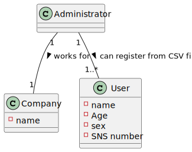

# US 014 - As an administrator, I want to load a set of users from a CSV file  #

## 1. Requirements Engineering

### 1.1. User Story Description

*As an administrator, I want to load a set of users from a CSV file*

### 1.2. Customer Specifications and Clarifications 

*"The DGS has Administrators who administer the application. Any Administrator uses the
application to register centers, SNS users, center coordinators, receptionists, and nurses enrolled in
the vaccination process."* 

### 1.3. Acceptance Criteria

*The application must support importing two types of CSV
files:*

*a) one type must have a header, column separation is done using “;”
character;*

*b) the other type does not have a header, column separation is done
using “,” character.*

### 1.4. Found out Dependencies

*No dependencies were found.*

### 1.5 Input and Output Data

*CSV file containing all pretended user's information to be registered*

### 1.6. System Sequence Diagram (SSD)

### 1.7 Other Relevant Remarks

## 2. OO Analysis

### 2.1. Relevant Domain Model Excerpt 

### 2.2. Other Remarks

*Use this section to capture some aditional notes/remarks that must be taken into consideration into the design activity. In some case, it might be usefull to add other analysis artifacts (e.g. activity or state diagrams).* 

## 3. Design - User Story Realization 

### 3.1. Rationale

**The rationale grounds on the SSD interactions and the identified input/output data.**

| Interaction ID                                                    | Question: Which class is responsible for... | Answer                         | Justification (with patterns)                          |
|:------------------------------------------------------------------|:--------------------------------------------|:-------------------------------|:-------------------------------------------------------|
| Step 1: Starts registering users from CSV file  		                | Interacting with the user							            | RegisterUsersFromCSVUI         | Responsible for user interactions                      |
|                                                                   | Coordinating the US                         | RegisterUsersFromCSVController | Controller                                             |
| Step 2: Request path to CSV file containing the users  		         | Request location of file  							           | RegisterUsersFromCSVUI         | Responsible for user interactions                      |
| Step 3: Specify CSV file path  		                                 | Specify file path 							                   | n/a                            |                                                        |
|                                                                   | Creating SNSUserStore                       | Company                        | Responsible for saving all store data                  |
| Step 4: Confirms the path to the file  		                         | Verify path 							                         | SNSUserStore                   | Responsible for enssuring the correct path to the file |
| Step 5: Confirms that wants to register users from this file      | 	Confirm registration process						         | RegisterUsersFromSVUI          | Responsible for user interactions                      |
|                                                                   | Creating SNSUser                            | SNSUserStore                   | Responsible for SNSUser instances creation             |
|                                                                   | Validating the data locally                 | SNSUser                        | Knows it's own data                                    |
|                                                                   | Validating the data globally                | SNSUserStore                   | Knows all SNSUsers registered                          |
|                                                                   | Saving the user data                        | SNSUserStore                   | Responsible for saving all SNSUser objects             |
| Step 6: Confirms registration has been completed successfully  		 | confirms registration 							               | RegisterUsersFromCSVUI         | Responsible for user interactions                      |              

### Systematization ##

According to the taken rationale, the conceptual classes promoted to software classes are: 

 * SNSUser
 * Company

Other software classes (i.e. Pure Fabrication) identified: 

 * RegisterUsersFromCSVUI  
 * RegisterUsersFromCSVController
 * SNSUserStore

## 3.2. Sequence Diagram (SD)

*In this section, it is suggested to present an UML dynamic view stating the sequence of domain related software objects' interactions that allows to fulfill the requirement.* 

## 3.3. Class Diagram (CD)

*In this section, it is suggested to present an UML static view representing the main domain related software classes that are involved in fulfilling the requirement as well as and their relations, attributes and methods.*

# 4. Tests 

**Test 1:** Check that is not possible to create a null instance of the SNSUser class.

    @Test
    void validateNotNullCreation () {
        assertThrows(IllegalArgumentException.class,
                () -> {
                    SNSUserDto user = new SNSUserDto(null, null, null, null, 0, null, 0, 0);
                });

    }

        
**Test 2:** Check that the SNSUserStore can see what type of CSV file are the users.

    @Test
    void validateVerifyCSVTypeHeader () {
        assertEquals(0, store.verifyCSVType("users"));
    }

**Test 3:** Check that the CSV file exist.

    @Test
    void validatePathToCSV () {
        assertTrue(store.validatePathToCSV("users"));
    }

**Test 4:** Check that the users are successfully added

    @Test
    void validateAddUsersConfirm () {
        assertTrue(store.addUsers("users"));
    }

# 5. Construction (Implementation)

*In this section, it is suggested to provide, if necessary, some evidence that the construction/implementation is in accordance with the previously carried out design. Furthermore, it is recommeded to mention/describe the existence of other relevant (e.g. configuration) files and highlight relevant commits.*

*SNSUser:*

    public SNSUser (String name, String gender, String birthDate, String address, int phoneNumber, String email, int snsNumber, int citizenCardNumber) {
        this.name = name;
        this.sex = gender;
        this.birthDate = birthDate;
        this.address = address;
        this.phoneNumber = phoneNumber;
        this.email = email;
        this.snsNumber = snsNumber;
        this.citizenCardNumber = citizenCardNumber;
        this.password = Password.generatePassword();
    }

*SNSUserDto:*

        public SNSUser (String name, String gender, String birthDate, String address, int phoneNumber, String email, int snsNumber, int citizenCardNumber) {
            checkRuleName(name);
            checkRuleGender(gender);
            checkRuleBirthDate(birthDate);
            checkRuleAddress(address);
            checkRulePhoneNumber(phoneNumber);
            checkRuleEmail(email);
            checkRuleSnsNumber(snsNumber);
            checkRuleCitizenCardNumber(citizenCardNumber);
            this.name = name;
            this.sex = gender;
            this.birthDate = birthDate;
            this.address = address;
            this.phoneNumber = phoneNumber;
            this.email = email;
            this.snsNumber = snsNumber;
            this.citizenCardNumber = citizenCardNumber;
            this.password = Password.generatePassword();
        }

*checkRule methods make sure that SNS user attributes are not null, for i.e.*

    private void checkRuleName(String name) {
        if (name == null)
            throw new IllegalArgumentException("Null name");
    }

*SNSUserStore:*

*verify what kind of CSV file are the users on*

    public int verifyCSVType(String pathToCSV) {
        File file = new File(pathToCSV);

        try {
            Scanner sc = new Scanner(file);
            String firstLine = sc.nextLine();
            if (firstLine.contains("name;sex;birth date;address;phone number;e-mail;sns user number;citizen card number"))
                return 0;
            sc.close();
        } catch (FileNotFoundException e) {
            e.printStackTrace();
        }

        return 1;
    }

*validate that the CSV file exist*

    public boolean validatePathToCSV(String pathToCSV) {
        File file = new File(pathToCSV);
        return file.exists();
    }

*validate that the users are added successfully*

    private boolean addUser(String pathToCSV) {
        File file = new File(pathToCSV);
        userListToVerify = new ArrayList<>();
        try {
            Scanner sc = new Scanner(file);
            String splitChar;
            if (verifyCSVType(pathToCSV) == 0) {
                sc.nextLine();
                splitChar = ";";
            } else {
                splitChar = ",";
            }

            /*
              This part will get the users from the CSV file
             */
            while (sc.hasNextLine()) {
                String[] userInfo = sc.nextLine().split(splitChar);
                SNSUserDto user = new SNSUserDto(userInfo[0], userInfo[1], userInfo[2], userInfo[3], Integer.parseInt(userInfo[4]), userInfo[5], Integer.parseInt(userInfo[6]), Integer.parseInt(userInfo[7]));
                if (validateSNSUser(user)) {
                    this.userListToVerify.add(user);
                } else {
                    return false;
                }
            }
            sc.close();
        } catch (FileNotFoundException e) {
            return false;
        }

        /*
            This part will add the users to the final ArrayList containing all users registered in the system.
         */
        for (SNSUserDto user : userListToVerify) {
            SNSUser newUser = SNSUserMapper.toModel(user);
            addUsersToSystem(newUser);
        }
        return true;
    }

# 6. Integration and Demo

*New option for adminUI*

# 7. Observations

*No observations*

