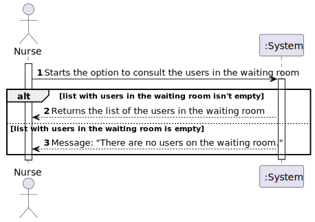
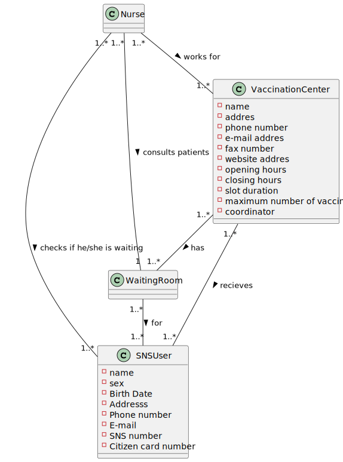
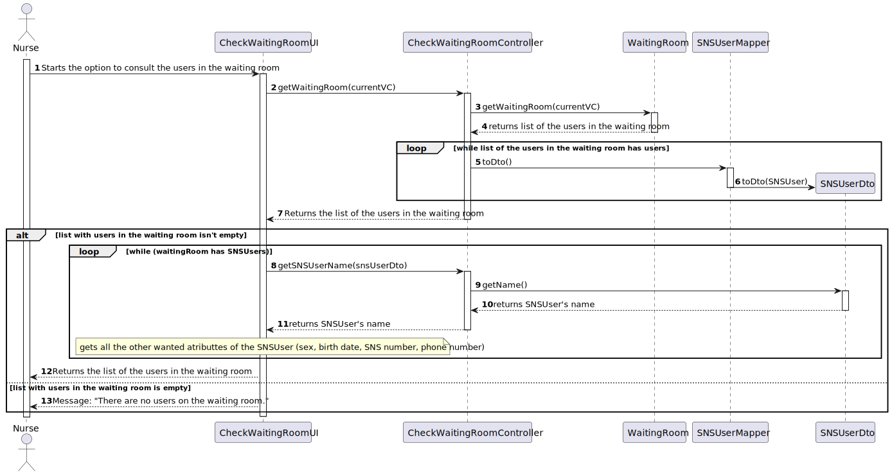
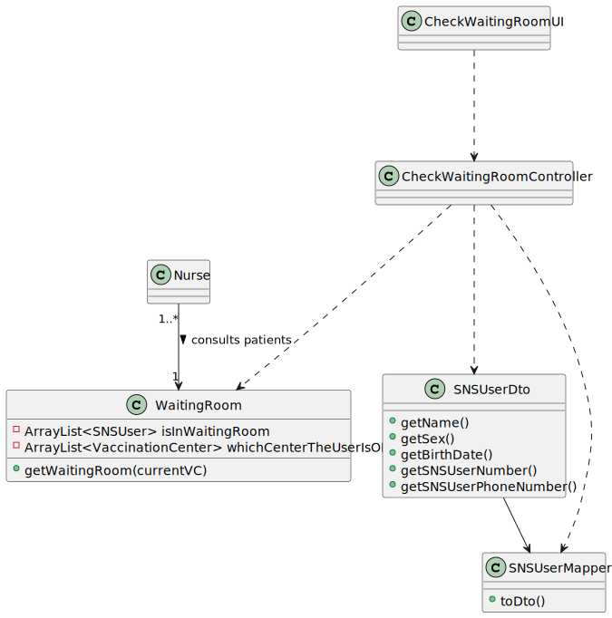

# US 005 - Consult the users in the waiting room of a vaccination center

## 1. Requirements Engineering

### 1.1. User Story Description

* As a nurse, I intend to consult the users in the waiting room of a vacination center.

### 1.2. Customer Specifications and Clarifications 
**From the specification document:**

* "A nurse responsible for administering the vaccine will use the application to 
check the list of SNS users that are present in the vaccination center to take 
the vaccine and will call one SNS user to administer him/her the vaccine."

**From the client's clarifications:**

* The system must display the Name, Sex, Birth Date, SNS User Number and Phone Number of the SNS User. (link for the clarification: https://moodle.isep.ipp.pt/mod/forum/discuss.php?d=16508)

* When the nurse starts to use the application, firstly, the nurse should select the vaccination center where she is working. The nurse wants to check the list of SNS users that are waiting in the vaccination center where she is working. (link for the clarification: https://moodle.isep.ipp.pt/mod/forum/discuss.php?d=16283)

### 1.3. Acceptance Criteria

* SNS Users’ list should be presented by order of arrival.

### 1.4. Found out Dependencies

* US 5 depends on US 4 because it needs that a registration of the SNS user arrival and its posterior sending to the waiting room.

### 1.5 Input and Output Data

**Input Data:**
* N/A

**Output Data:** 
* List of the SNS Users (Name, Sex, Birth Date, SNS User Number and Phone Number) in the waiting room of a certain vaccination center.

### 1.6. System Sequence Diagram (SSD)

### 1.7 Other Relevant Remarks

* None.

## 2. OO Analysis

### 2.1. Relevant Domain Model Excerpt 

### 2.2. Other Remarks

* None. 

## 3. Design - User Story Realization 

### 3.1. Rationale

**The rationale grounds on the SSD interactions and the identified input/output data.**

| Interaction ID                                                     | Question: Which class is responsible for...                                           | Answer                                      | Justification (with patterns)             |
|:-------------------------------------------------------------------|:--------------------------------------------------------------------------------------|:--------------------------------------------|:------------------------------------------|
| Step 1: Starts the option to consult the users in the waiting room | Communicate with the user?                                                            | CheckWaitingRoomUI                          | Responsible for interacting with the user |
|                                                                    | Coordinating the operations?                                                          | CheckWaitingRoomController                  | Controller                                |
|                                                                    | Creating the list with the users on the waiting room of a certain vaccination center? | WaitingRoom                                 | Knows all the waiting rooms               |
| Step 2: Returns the list of the users in the waiting room          | Showing the list?                                                                     | CheckWaitingRoomUI                          | Responsible for interacting with the user |
| Step 3: Message: "There are no users on the waiting room."         | Showing the message?                                                                  | CheckWaitingRoomUI                          | Responsible for interacting with the user |

### Systematization ##

According to the taken rationale, the conceptual classes promoted to software classes are: 

 * WaitingRoom

Other software classes (i.e. Pure Fabrication) identified: 
 * CheckWaitingRoomUI  
 * CheckWaitingRoomController

## 3.2. Sequence Diagram (SD)

## 3.3. Class Diagram (CD)

# 4. Tests 

**Test 1:** Check that I get the ArrayList that contains the expected data. 

	@Test
    void getWaitingRoom() {
        CenterCoordinator cc1 =new CenterCoordinator("Ana","Casa da Ana",927641959,"ana@gmail.com",12345678);
        VaccineType vt1 = new VaccineType("qwert","Covid","mRNA");
        SNSUser user = new SNSUser("João","Masculine","28/4/2002","Paredes",123456789,"joao@gmail.com",892375901,83472195);
        SNSUser user2 = new SNSUser("Diana","Feminine","28/6/2004","Cabeceiras",927834832,"diana@gmail.com",12345678,213987628);
        MassVaccinationCenter vc1 = new MassVaccinationCenter("CentroTeste1","Rua do CentroTeste1","987321654","centroteste1@gmail.com","1234567890","www.centroteste1.com","8:00","16:00",5,5,cc1,vt1);
        WaitingRoom.addToWaitingRoom(vc1, user);
        WaitingRoom.addToWaitingRoom(vc1, user2);
        ArrayList<SNSUser> expected = new ArrayList<>();
        expected.add(user);
        expected.add(user2);

        assertEquals(expected,WaitingRoomStore.getWaitingRoom(vc1));
    }
  
    
**Test 2:** Check that I get an empty ArrayList when nothing is added to it.

    @Test
    void getWaitingRoomEmpty(){
    ArrayList<SNSUser> expected = new ArrayList<>();
    assertEquals(expected, WaitingRoom.getWaitingRoom());
    }

# 5. Construction (Implementation)
**Class WaitingRoom**

    public static ArrayList<SNSUser> getWaitingRoom(VaccinationCenter currentVC){
        ArrayList<SNSUser> waitingRoom = new ArrayList<>();
        int counter = 0;
        for (VaccinationCenter vc : whichCenterTheUserIsON){
            if (vc.equals(currentVC)){
                waitingRoom.add(isInWaitingRoom.get(counter));
            }
        counter++;
        }
        return waitingRoom;
    }

# 6. Integration and Demo 
* New option to the NurseUI.

# 7. Observations

* No observations.

