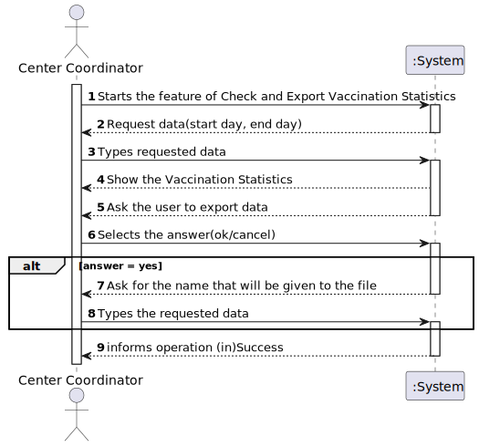
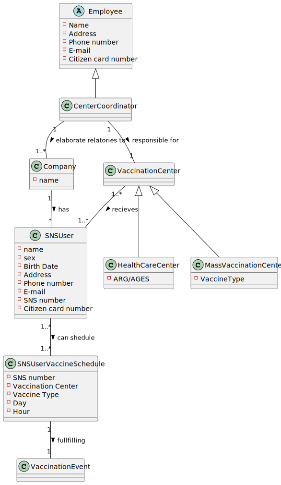
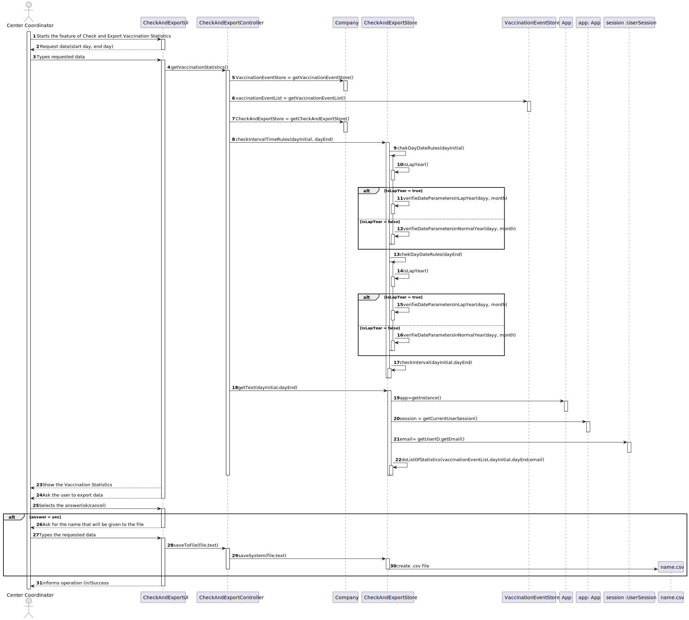
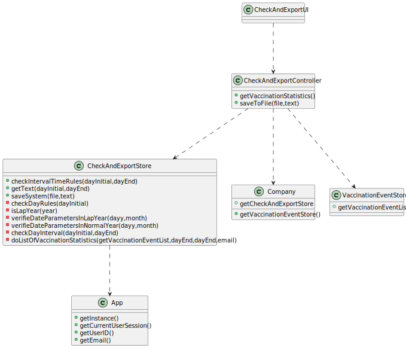

# US 15 -  Check and export vaccination statistics. 

## 1. Requirements Engineering

### 1.1. User Story Description

As a Center Coordinator, I intend to check and export vaccination statistics. I want to export, to a vcs file, the total number of fully vaccinated users per day

### 1.2. Customer Specifications and Clarifications 
**Questions**
* 1.When exporting vaccination statistics,do we export the data from all days available in the system or does the center coordinator chooses the time interval?
* 2.Is there any kind of format our exported data should follow?"
* 3.Is the exportation of the CSV file that contains the total number of fully vaccinated users per day, the only feature that needs to be implemented in code, for US15?
* 4.Should the user introduce the name of the file intended to export the vaccination statistics ?
* 5.Are the vaccination statistics referring only to the fully vaccinated users or referring to something more ? 

**Answer**
* 1.The user should define a time interval (two dates).
* 2.Data format: date; number of fully vaccinated user.
* 3.Yes
* 4.The user should introduce the name of the file.
* 5.Only to fully vaccinated users.

### 1.3. Acceptance Criteria

*n/a*

### 1.4. Found out Dependencies

* There is a dependency with US1, because to have vaccination statistics is required a vaccination schedule
* There is a dependency with US2, because to have vaccination statistics is required a vaccination schedule
* There is a dependency with US4, because to have vaccination statistics is required a register of an arrival of a Sns User at the Vaccination center
* There is a dependency with US5, because to have vaccination statistics is required a list of user available to take the vaccine
* There is a dependency with US6, because to have vaccination statistics to export its needed the record of daily vaccinated user in each vaccination center
* There is a dependency with US8, because to have vaccination statistics is required the record of the vaccination event
* There is a dependency with US9, because to have vaccination statistics is required a vaccination center when users get vaccinated
* There is a dependency with US10, because to have vaccination statistics is required a center coordinator to export the data and employees work on vaccination process
* There is a dependency with US12, because to have vaccination statistics is required a vaccine type to schedule a vaccine
* There is a dependency with US13, because to have vaccination statistics is required a vaccine to have a vaccination event
* There is a dependency with US14, because to have vaccination statistics is required users to use the app and get vaccinated

### 1.5 Input and Output Data
**Input data**

* Typed data
  * name that will be given to the csv file

* Selected Data
  * ok/cancel to export/not export the csv file

**Output data**
* csv file containing the total number of fully vaccinated users per day

### 1.6. System Sequence Diagram (SSD)

### 1.7 Other Relevant Remarks

* n/a

## 2. OO Analysis

### 2.1. Relevant Domain Model Excerpt 

### 2.2. Other Remarks

* n/a

## 3. Design - User Story Realization 

### 3.1. Rationale

**The rationale grounds on the SSD interactions and the identified input/output data.**

| Interaction ID | Question: Which class is responsible for... | Answer  | Justification (with patterns)  |
|:-------------  |:--------------------- |:------------|:---------------------------- |
|Step 1:Starts the feature of Check and Export Vaccination Statistics	|...interacting whit the actor?                   |CheckAndExportUI          |Pure Fabrication: there is no reason to assign this responsibility to any existing class in the Domain Model                               |
|   		                                                            |...coordinating the US?			              |CheckAndExportController  |Controller                              |  
|   		                                                            |..knows the user using the system?               |App                       |IE: have current user session                              |  
|   		                                                            |                                                 |Company                   |IE: knows his employees/users                              |  
|   		                                                            |                                                 |Center Coordinator        |IE: knows its own data                              |  
|Step 2:Request data(start day, end day)   		                        |n/a							                  |                          |                              |
|Step 3:Types requested data   		                                    |...validate the input data?                      |CheckAndExportStore       |IE: have it owns methods                              |
|   		                                                            |...get list of Vaccination Events?               |VaccinationEventStore     |IE: the list of vaccination events are defined on VaccinationEventStore                              |
|   		                                                            |...validate the Vaccination Events?              |CheckAndExportStore       |IE: have it owns methods                              |
|   		                                                            |...do a list of Vaccination Statistics?          |CheckAndExportStore       |IE: have it owns methods                              |
|Step 4:Show the Vaccination Statistics   		                        |...get Vaccination Statistics?			          |CheckAndExportStore       |IE: have the list created on step 3                             |
|Step 5:Ask the user to export data   		                            |n/a							                  |                          |                              |
|Step 6:Selects the answer(ok/cancel)   		                        |...read the answer?				              |CheckAndExportUI          |IE: responsible for user interaction                              |              
|                                       		                        |...check the answer to know the next step?		  |CheckAndExportController  |Controller                              |
|Step 7:Ask for the name that will be given to the file                 |n/a							                  |                          |                              |
|Step 8:Types the requested data   		                                |...read the file name                            |CheckAndExportUI          |IE: responsible for user interaction                              |
|                                		                                |...create the file with Vaccination Statistics?  |CheckAndExportStore       |IE: have it owns methods                              |
|Step 9:informs operation (in)Success   		                        |...informing operation (in)Success?			  |CheckAndExportUI          |IE: responsible for user interaction                              |

### Systematization ##

According to the taken rationale, the conceptual classes promoted to software classes are: 

 * App
 * Company
 * Center Coordinator
 * VaccinationEventStore

Other software classes (i.e. Pure Fabrication) identified: 
 * CheckAndExportUI  
 * CheckAndExportController
 * CheckAndExportStore

## 3.2. Sequence Diagram (SD)

*In this section, it is suggested to present an UML dynamic view stating the sequence of domain related software objects' interactions that allows to fulfill the requirement.* 

## 3.3. Class Diagram (CD)

*In this section, it is suggested to present an UML static view representing the main domain related software classes that are involved in fulfilling the requirement as well as and their relations, attributes and methods.*

# 4. Tests 

**Test 1:** Check that it is possible to see the statistics for a valid interval 

	@Test
    void checkIntervalValid() {
        store.checkInterval("30/04/2023","01/05/2023");
    }

**Test 2:** Check that it is not possible to see the statistics for an invalid interval (end day is after initial day)

	@Test(expected = IllegalArgumentException.class)
		public void ensureNullIsNotAllowed() {
		Exemplo instance = new Exemplo(null, null);
	}

**Test 3:** Check a valid interval whit two correct dates and the end date is after initial date

	@Test
    void checkValid() {
        String expected1 = "26/08/2023";
        String expected2 = "27/08/2023";
        store.checkIntervalTimeRules(expected1,expected2);
    }

**Test 4:** Check an invalid date 

	@Test
    void verifieDateParametersInLeapYearInvalidDay30DaysMonth() {
        assertThrows(IllegalArgumentException.class,
                () -> {
                    store.chekDayDateRules("31/04/2024");
                });
    }

# 5. Construction (Implementation)

**CheckAndExportController**

    @FXML
    public void getVaccinationStatistics(ActionEvent event) throws ParseException, FileNotFoundException {
        String dayInitial = strDate.getEditor().getText();
        String dayEnd = edDate.getEditor().getText();
        boolean checker;
        checker=store.checkIntervalTimeRules(dayInitial, dayEnd);
        if(checker){
            String txt = store.getText(dayInitial,dayEnd);
            txtArea.clear();
            txtArea.setText(txt);
            Alert alert = new Alert(Alert.AlertType.CONFIRMATION);
            alert.setTitle("Save");
            alert.setHeaderText("Do you want to save ths statistics.");
            alert.setResizable(false);
            alert.setContentText("Select okay or cancel.");
            Optional<ButtonType> result = alert.showAndWait();
            saveToFile(result);
        }
    }

    public void saveToFile(Optional<ButtonType> result) throws FileNotFoundException {
        if(!result.isPresent()) {
            txtArea.clear();
        }else if(result.get() == ButtonType.OK) {
            FileChooser.ExtensionFilter extFilter = new FileChooser.ExtensionFilter("CSV files (*.csv)", "*.csv");
            fileChooser.getExtensionFilters().add(extFilter);
            File file = fileChooser.showSaveDialog(new Stage());
            if (file != null) {
                store.saveSystem(file,txtArea.getText());
            }
        }else if(result.get() == ButtonType.CANCEL){
            txtArea.clear();
        }
    }

**CheckAndExportStore**

    public boolean checkIntervalTimeRules(String dayInitial, String dayEnd){
        try {
            chekDayDateRules(dayInitial);
        }catch (IllegalArgumentException e){
            Alert errorAlert = new Alert(Alert.AlertType.ERROR);
            errorAlert.setHeaderText("Input not valid on Start Date");
            errorAlert.setContentText(e.getMessage());
            errorAlert.showAndWait();
            return false;

        }
        try {
            chekDayDateRules(dayEnd);
        }catch (IllegalArgumentException e){
            Alert errorAlert = new Alert(Alert.AlertType.ERROR);
            errorAlert.setHeaderText("Input not valid on End Date");
            errorAlert.setContentText(e.getMessage());
            errorAlert.showAndWait();
            return false;
        }
        try {
            checkInterval(dayInitial,dayEnd);
        }catch (IllegalArgumentException e){
            Alert errorAlert = new Alert(Alert.AlertType.ERROR);
            errorAlert.setHeaderText("Invalid");
            errorAlert.setContentText(e.getMessage());
            errorAlert.showAndWait();
            return false;
        }
        return true;
    }

# 6. Integration and Demo 

* A new menu created for Center Coordinator
* A new function was added to Center Coordinator menu
* New function added was created whit graphical user interface

# 7. Observations

