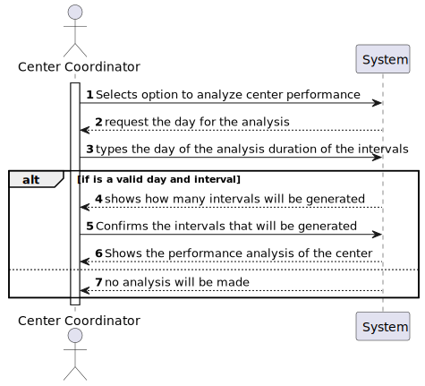
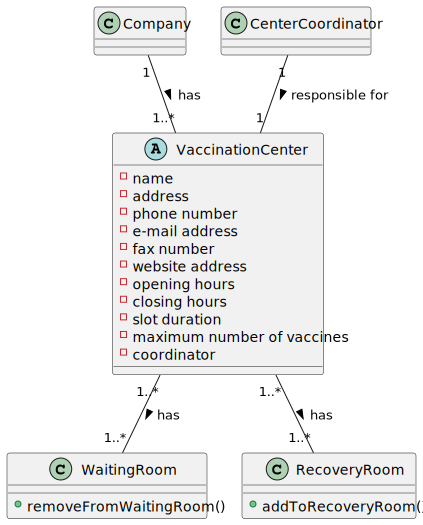
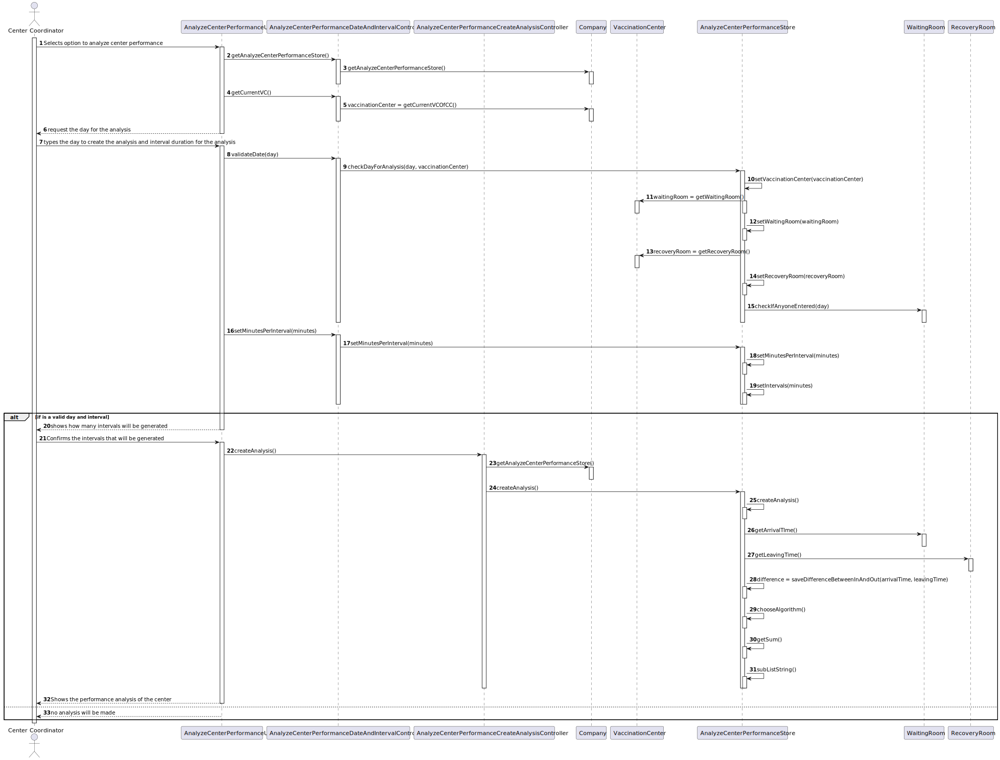
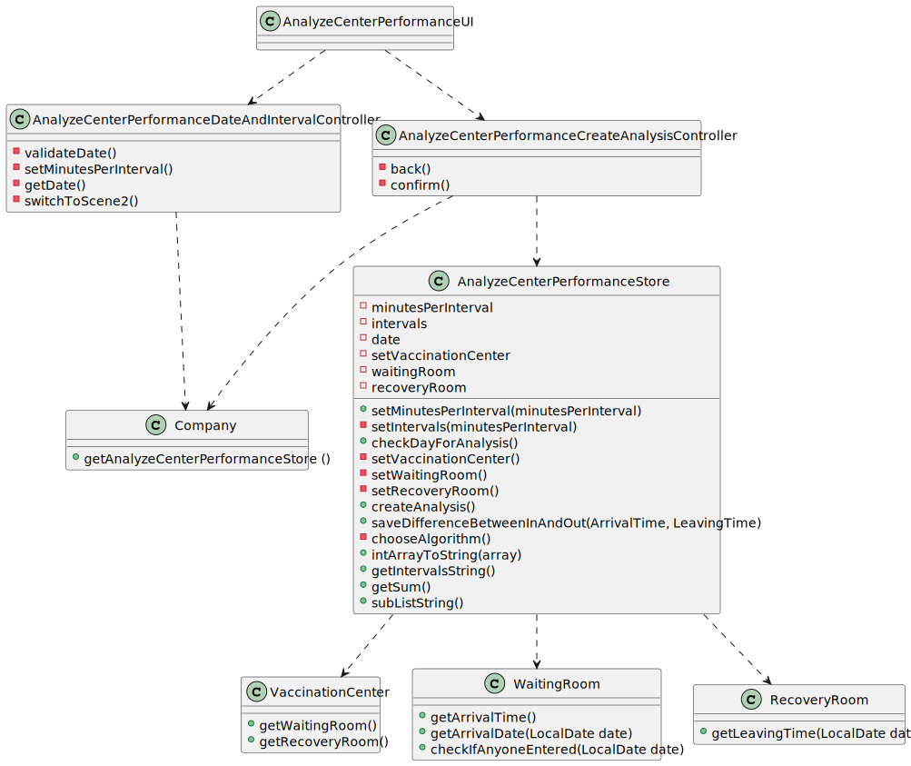

# US 016 - As a center coordinator, I intend to analyze the performance of center.

## 1. Requirements Engineering

### 1.1. User Story Description

*As a center coordinator, I intend to analyze the performance of center.*

### 1.2. Customer Specifications and Clarifications 

* The user should have the option to choose the algorithm to use through a configuration file or while running the application.
* The user can introduce any interval value for analysing the center performance.

### 1.3. Acceptance Criteria

### 1.4. Found out Dependencies

* US10 to register a new center coordinator
* US9 to register a new vaccination center
* US14 to register users into the system
* US4 to check the user arrival at the center

### 1.5 Input and Output Data

#### Input:

* Day and time intervals of m minutes 

### Output:

* Number of list that will be created
* The most efficient hours of the vaccination center

### 1.6. System Sequence Diagram (SSD)

### 1.7 Other Relevant Remarks

## 2. OO Analysis

### 2.1. Relevant Domain Model Excerpt 
*In this section, it is suggested to present an excerpt of the domain model that is seen as relevant to fulfill this requirement.* 

### 2.2. Other Remarks

## 3. Design - User Story Realization 

### 3.1. Rationale

**The rationale grounds on the SSD interactions and the identified input/output data.**

| Interaction ID                        | Question: Which class is responsible for...                                | Answer                                            | Justification (with patterns)                                                      |
|:--------------------------------------|:---------------------------------------------------------------------------|:--------------------------------------------------|:-----------------------------------------------------------------------------------|
| Step 1  		                            | interacting with the user						                                            | AnalyzeCenterPerformanceUI                        | responsible for user interaction                                                   |
|                                       | coordinating the US                                                        | AnalyzeCenterPerformanceDateAndIntervalController | controller                                                                         |
|                                       | get the AnalyzeCenterPerformanceStore                                      | Company                                           | responsible for storing store data                                                 |
|                                       | get the current vaccination center                                         | Company                                           | Knows it's users and were do they work                                             |
| Step 2  		                            | requesting the date to analyze 							                                     | AnalyzeCenterPerformanceUI                        | responsible for user interaction                                                   |
| Step 3  		                            | n/a  							                                                               |                                                   |                                                                                    |
|                                       | getting the waiting room                                                   | VaccinationCenter                                 | it knows its waiting room                                                          |
|                                       | getting the recovery room                                                  | VaccinationCenter                                 | it knows its recovery room                                                         |
|                                       | saving the waiting room                                                    | AnalyzeCenterPerformanceStore                     | knows the vaccination center to be analyzed therefore also knows the waiting room  |
|                                       | saving the recovery room                                                   | AnalyzeCenterPerformanceStore                     | knows the vaccination center to be analyzed therefore also knows the recovery room |
|                                       | check if the day introduced is valid                                       | Waiting room                                      | Knows if a user entered a certain day to the center                                |
|                                       | saving the minutes per interval                                            | AnalyzeCenterPerformanceStore                     | Knows all data to be considered for the analysis                                   |
|                                       | saving the amount of intervals that will be generated                      | AnalyzeCenterPerformanceStore                     | Knows all data to be considered for the analysis                                   |
| if both day and intervals are valid : |                                                                            |                                                   |                                                                                    |
| Step 4  		                            | show list of intervals 							                                             | AnalyzeCenterPerformanceUI                        | responsible for user interaction                                                   |
| Step 5  		                            | confirming information  							                                            | n/a                                               |                                                                                    |
|                                       | coordinating the US                                                        | AnalyzeCenterPerformanceCreateAnalysisController  | controller                                                                         | 
|                                       | get the AnalyzeCenterPerformanceStore                                      | Company                                           | responsible for storing store data                                                 |
|                                       | creating the analysis                                                      | AnalyzeCenterPerformanceStore                     | responsible for analysing the performance of a center                              |
|                                       | getting the arrival time list                                              | WaitingRoom                                       | Knows when a user entered the vaccination center                                   |
|                                       | getting the leaving time list                                              | RecoveryRoom                                      | knows when a user leaves the vaccination center                                    |
|                                       | create a list with the difference of users who entered and left the center | AnalyzeCenterPerformanceStore                     | knows when a user enters and when he/she leaves                                    |
|                                       | chose an algorithm to use for the performance analysis                     | AnalyzeCenterPerformanceStore                     | Knows which algorithm the users wants to use through a config file                 |
|                                       | get the intervals were the center were more efficient                      | AnalyzeCenterPerformanceStore                     | contains the algorithm to apply over the difference list                           |
|                                       |                                                                            |                                                   |                                                                                    |
| Step 6  		                            | Shows the interval were the vaccination center was more efficient						    | AnalyzeCenterPerformanceUi                        | responsible for user interaction                                                   |              
| else                                  |                                                                            |                                                   |                                                                                    |
| Step 4                                | no analysis will be made                                                   | n/a                                               |                                                                                    |

### Systematization ##

According to the taken rationale, the conceptual classes promoted to software classes are: 

* Company
* VaccinationCenter
* WaitingRoom
* RecoveryRoom

Other software classes (i.e. Pure Fabrication) identified: 

* AnalyzeCenterPerformanceUI  
* AnalyzeCenterPerformanceDateAndIntervalController
* AnalyzeCenterPerformanceCreateAnalysisController
* AnalyzeCenterPerformanceStore

## 3.2. Sequence Diagram (SD)

*In this section, it is suggested to present an UML dynamic view stating the sequence of domain related software objects' interactions that allows to fulfill the requirement.* 

## 3.3. Class Diagram (CD)

*In this section, it is suggested to present an UML static view representing the main domain related software classes that are involved in fulfilling the requirement as well as and their relations, attributes and methods.*

# 4. Tests 

**Test 1: brute force algorithm test** 

    @Test
    void bruteForceTest() {
        int[] example = {29, -32, -9, -25, 44, 12, -61, 51, -9, 44, 74, 4}; // 164
        int[] expected = {51, -9, 44,74,4};
        assertArrayEquals(expected, store.bruteForce(example));
    }

**Test 2: check day for analysis**

    @Test
    void testCheckDayForAnalysis() {
        waitingRoom.addToWaitingRoom(user1, date, time);
        assertTrue(store.checkDayForAnalysis(date, vc1));
    }

# 5. Construction (Implementation)

**Set the minutes that every interval have**

    public void setMinutesPerInterval(int minutes) {
        minutesPerInterval = minutes;
        setIntervals(minutesPerInterval);
    }

    
**Validate date for the analysis**

    public Boolean checkDayForAnalysis(LocalDate date, VaccinationCenter vaccinationCenter) {
        this.date = date;
        setVaccinationCenter(vaccinationCenter);
        return this.waitingRoom.checkIfAnyoneEntered(date);
    }

    
**Getting the list with the difference of users in and out the vaccination center**

    private int[] saveDifferenceBetweenInAndOut(List<LocalTime> arrivalTime, List<LocalTime> leavingTime) {
        int[] difference = new int[intervals];
        String openingHour = this.vaccinationCenter.getOpenHour();
        String[] timeSplit = openingHour.split(":");
        LocalTime time = LocalTime.of(Integer.parseInt(timeSplit[0]), Integer.parseInt(timeSplit[1]));

        for (int differencePos = 0; differencePos < difference.length; differencePos++) {
            LocalTime time2 = time.plusMinutes(minutesPerInterval);
            for (int i = 0; i < arrivalTime.size(); i++) {
                if (arrivalTime.get(i).isBefore(time2) && (arrivalTime.get(i).isAfter(time) || arrivalTime.get(i).equals(time))) {
                    difference[differencePos]++;
                }
                if (leavingTime.get(i).isBefore(time2) && (leavingTime.get(i).isAfter(time) || leavingTime.get(i).equals(time)))
                    difference[differencePos]--;
            }
            time = time2;
        }
        return difference;
    }

# 6. Integration and Demo 

* Added a new option in center coordinator ui

# 7. Observations

* No observations

