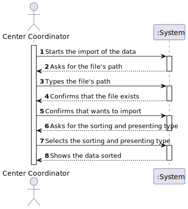
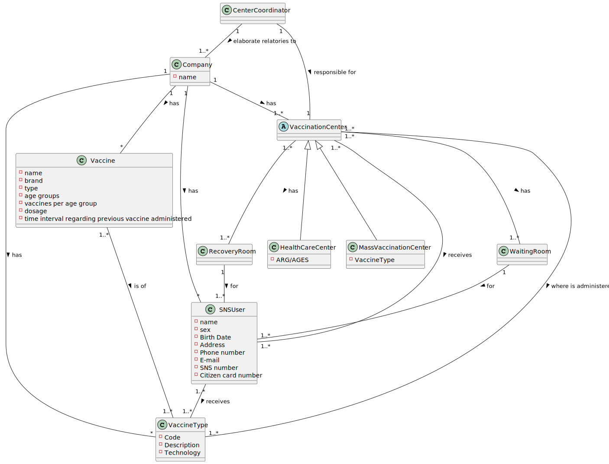
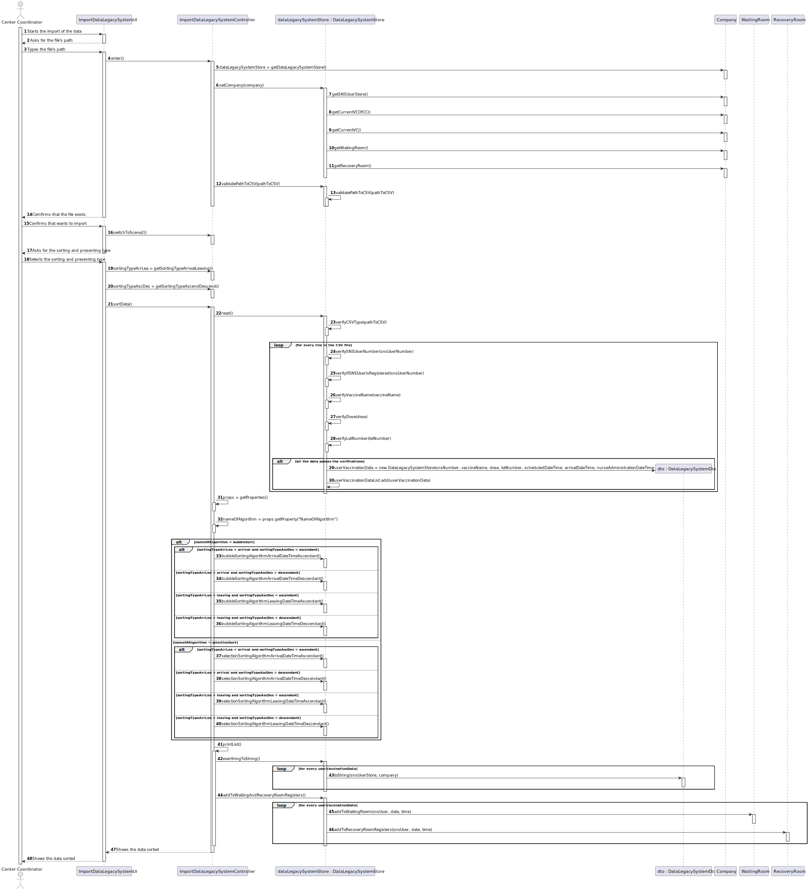
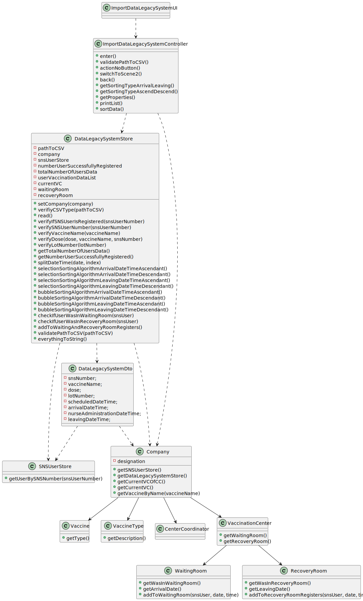

# US 017 - Import data from a legacy system that was used in the past to manage centers

## 1. Requirements Engineering

### 1.1. User Story Description

*As a center coordinator, I want to import data from a legacy system that was used in the past to manage centers. 
The imported data should be presented to the user sorted by arrival time or by the center leaving time. The name of 
the SNS user and the vaccine type Short Description attribute should also be presented to the user.*

### 1.2. Customer Specifications and Clarifications 

***From the client's ckarifications:***

* *"Each algorithm should be capable of doing both sortings. The application should be prepared to run both algorithms. 
The algorithm that will be used to sort data should be defined in a configuration file." (link for the forum: https://moodle.isep.ipp.pt/mod/forum/discuss.php?d=16767)*

* *"That file is from a legacy system, that uses a different date and time format. The date and time should be converted when loading the data into the application that we are developing." (link for the forum: https://moodle.isep.ipp.pt/mod/forum/discuss.php?d=16789)*

* *"SNS users that are not registered should be loaded/registered. The other SNS users should not be registered again and should be ignored." (link for the forum: https://moodle.isep.ipp.pt/mod/forum/discuss.php?d=16886)*

### 1.3. Acceptance Criteria

*Two sorting algorithms should be implemented (to be chosen manually by the coordinator), and worst-case time complexity 
of each algortihm should be documented in the application user manual (in the annexes) that must be delivered with the application.
The center coordinator must be able to choose the file that is to be uploaded.*

### 1.4. Found out Dependencies

* *US17 depends on US14 because the SNS users presented in the imported data from the legacy system need to be registered in the system.*
* *US17 depends on US13 because the vaccine imported needs to be registered in the system.*

### 1.5 Input and Output Data

***Input data:***

* *Imported: File with SNS users' number, vaccines names, dose, lot number,
scheduled date and time, date and time of the arrival in the vaccination center, date and time of the administration of the 
vaccine by the nurse, date and time of when the SNS user leaved the vaccination center.*

***Output data:***

* *SNS users' name and number, vaccine names, vaccine type short description, dose, lot number, scheduled date and time, date and time of the arrival in the vaccination center, date and time of the administration of the vaccine by the nurse, date and time of when the SNS user leaved the vaccination center.
All of this sorted by either arrival or leaving time, and presented either ascending or descending.* 

### 1.6. System Sequence Diagram (SSD)

### 1.7 Other Relevant Remarks

N/A

## 2. OO Analysis

### 2.1. Relevant Domain Model Excerpt 

### 2.2. Other Remarks

N/A
## 3. Design - User Story Realization 

### 3.1. Rationale

| Interaction ID                            | Question: Which class is responsible for... | Answer                           | Justification (with patterns)         |
|:------------------------------------------|:--------------------------------------------|:---------------------------------|:--------------------------------------|
| Step 1 : Starts the import of the data  		 | Interacting with the user                   | ImportDataLegacySystemUI         | Responsible for user interactions     |
|                                           | Coordinating the operations                 | ImportDataLegacySystemController | Controller                            |
| Step 2 : Asks for the file's path		       | Request location of the file                | ImportDataLegacySystemUI         | Responsible for user interactions     |
| Step 3 : Types the file's path		          | Type the file's path                        | n/a                              |                                       |
|                                           | Creating DataLegacySystemStore              | Company                          | Responsible for saving all store data |
|                                           | Getting all the stores needed               | Company                          | Knows all the stores                  |
| Step 4 : Confirms that the file exists 		 | Validating the CSV file path             | DataLegacySystemStore            | Responsible for enssuring the correct path to the file                                      |
| Step 5 : Confirms that wants to import		  | 							                                     |                                  |                                       |
| Step 6 : Asks for the sorting and presenting type | 						                                      |                                  |                                       |              
| Step 7 : Selects the sorting and presenting type | 							                                     |                                  |                                       |
| Step 8 : Shows the data sorted	           | 							                                     |                                  |                                       |

### Systematization ##

According to the taken rationale, the conceptual classes promoted to software classes are: 

 * Company

Other software classes (i.e. Pure Fabrication) identified: 
 * ImportDataLegacySystemUI  
 * ImportDataLegacySystemController
 * DataLegacySystemStore

## 3.2. Sequence Diagram (SD)

## 3.3. Class Diagram (CD)

# 4. Tests 

**Test 1:**  

	@Test
    void verifyCSVType() {
        assertEquals(0, store.verifyCSVType("performanceDataFromGaoFuNationalCenterDoPortoVaccinationCenter.csv"));
    }

**Test 2:**

    @Test
    void verifyIfSNSUserIsRegistered() {
        SNSUser user1 = new SNSUser("Alex","Masculino","2003/4/2","Francos",123456789,"alex@gmail.com",123456789,12345678);
        snsUserStore.addUsersToSystem(user1);
        assertTrue(store.verifyIfSNSUserIsRegistered(user1.getSnsNumber()));
    }
*It is also recommended to organize this content by subsections.* 

# 5. Construction (Implementation)
**Selection Sort Algorithm**
    public void selectionSortingAlgorithmArrivalDateTimeAscendant() {
        //ascendant - first to last
        for (int i = 0; i < userVaccinationDataList.size() - 1; i++) {
            int index = i;
            for (int j = i + 1; j < userVaccinationDataList.size(); j++) {
                if (userVaccinationDataList.get(j).getArrivalDateTime().isBefore(userVaccinationDataList.get(index).getArrivalDateTime())) {
                    index = j;//searching for lowest index
                }
            }
            DataLegacySystemDto userVaccinationDataSwap = userVaccinationDataList.get(index);
            userVaccinationDataList.set(index, userVaccinationDataList.get(i));
            userVaccinationDataList.set(i, userVaccinationDataSwap);
        }
    }

**Bubble Sort Algorithm**
    public void bubbleSortingAlgorithmArrivalDateTimeAscendant() {
        //ascendant - first to last
        for (int i = 0; i < userVaccinationDataList.size() - 1; i++) {
            for (int j = 0; j < userVaccinationDataList.size() - i - 1; j++) {
                if (userVaccinationDataList.get(j + 1).getArrivalDateTime().isBefore(userVaccinationDataList.get(j).getArrivalDateTime())) {
                    DataLegacySystemDto userVaccinatioDataSwap = userVaccinationDataList.get(j);
                    userVaccinationDataList.set(j, userVaccinationDataList.get(j + 1));
                    userVaccinationDataList.set(j + 1, userVaccinatioDataSwap);
                }
            }
        }
    }
    
# 6. Integration and Demo 

*Added a new option to the Center Coordinator UI.*

# 7. Observations

N/A

