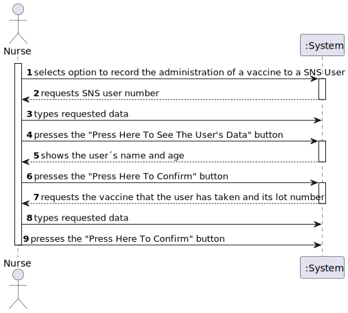
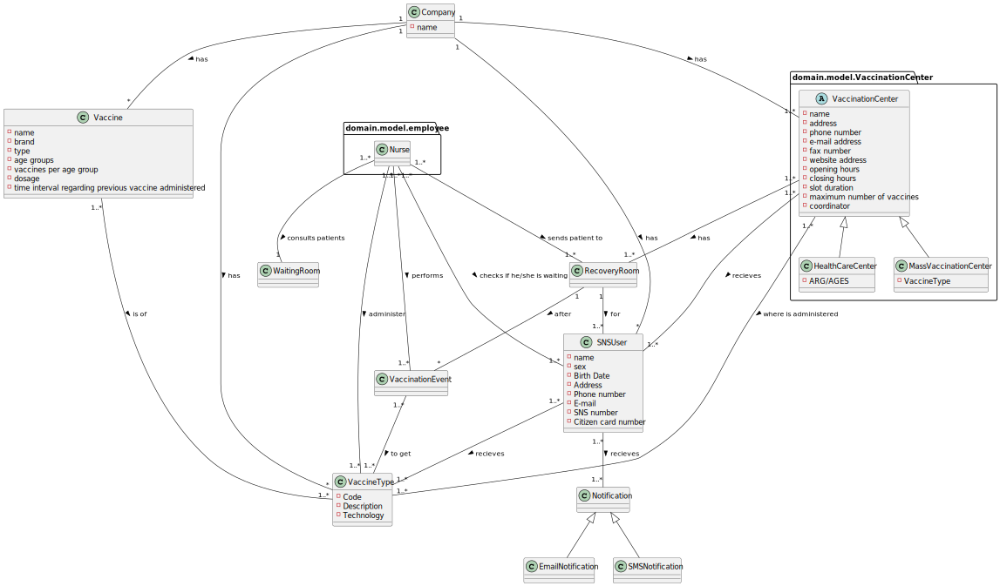
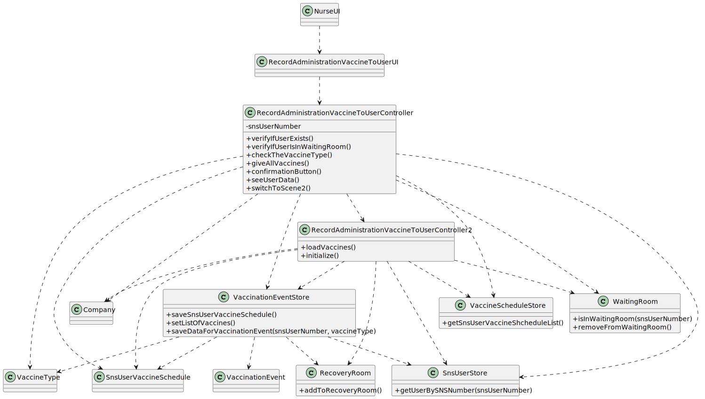

# US 008 - Record the administration of a vaccine to a SNS User

## 1. Requirements Engineering

### 1.1. User Story Description

* As a nurse, I want to record the administration of a vaccine to a SNS User. At the end of the recovery period, the user should receive a SMS message informing the SNS user that he can leave the vaccination center

### 1.2. Customer Specifications and Clarifications 

**From the specifications document:**

* "After giving the vaccine to the user, each nurse registers the event in the system,
  more precisely, registers the vaccine type (e.g.: Covid-19), vaccine name/brand (e.g.: Astra Zeneca,
  Moderna, Pfizer), and the lot number used. Afterwards, the nurse sends the user to a recovery room,
  to stay there for a given recovery period (e.g.: 30 minutes). If there are no problems, after the given
  recovery period, the user should leave the vaccination center. The system should be able to notify
  (e.g.: SMS or email) the user that his/her recovery period has ended."

### 1.3. Acceptance Criteria

* The nurse should select a vaccine and the administered dose number.

### 1.4. Found out Dependencies

* Depends on US4 since users have to be in the waiting room before they get vaccinated.
* Depends on US14 to get the users details from the database.
* Depends on US13 to get the vaccine data of new vaccines.

### 1.5 Input and Output Data

**Input data :**

* SNS user number
* Vaccine Name
* Vaccine Lot Number

**Output data :**

* List with Vaccination Events

### 1.6. System Sequence Diagram (SSD)

### 1.7 Other Relevant Remarks

n/a

## 2. OO Analysis

### 2.1. Relevant Domain Model Excerpt 

### 2.2. Other Remarks

n/a

## 3. Design - User Story Realization 

### 3.1. Rationale

**The rationale grounds on the SSD interactions and the identified input/output data.**

| Interaction ID                                                                      | Question: Which class is responsible for...                                                | Answer                                       | Justification (with patterns)                                                                                |
|:------------------------------------------------------------------------------------|:-------------------------------------------------------------------------------------------|:---------------------------------------------|:-------------------------------------------------------------------------------------------------------------|
| Step 1 : selects option to record the administration of a vaccine to a SNS User  		 | selecting an option to record the administration of a vaccine to a SNS User							         | n/a                                          |                                                                                                              |
|                                                                                     | opening "RecordAdministrationVaccineToUserUI" in a JavaFX window                           | NurseUI                                      | Pure Fabricator: there is no reason to assign this responsibility to any existing class in the Domain Model. | 	
| Step 2 : requests SNS user number		                                                 | requesting SNS user number							                                                          | RecordAdministrationVaccineToUserUI          | IE: Responsible for user interaction                                                                         |
| Step 3 : types requested data		                                                     | typing the requested data							                                                           | n/a                                          |                                                                                                              |
| Step 4 : presses the "Press Here To See The User's Data" button		                   | pressing the "Press Here To See The User's Data" button							                             | n/a                                          |                                                                                                              |
|                                                                                     | running the method seeUserData()                                                           | RecordAdministrationVaccineToUserController  | Controller                                                                                                   |
|                                                                                     | verifying if user exists                                                                   | SnsUserStore                                 | IE: Knows the data from all Sns Users                                                                        |
|                                                                                     | verifying if user is in waiting room                                                       | WaitingRoom                                  | IE: Knows the data from all waiting rooms                                                                    |
|                                                                                     | requesting the name and age of the user                                                    | SnsUserStore                                 | IE: Knows the data from all Sns Users                                                                        |
| Step 5 : shows the user´s name and age		                                            | showing the user´s name and age							                                                     | RecordAdministrationVaccineToUserUI          | IE: Responsible for user interaction                                                                         |
| Step 6 : presses the "Press Here To Confirm" button		                               | pressing the "Press Here To Confirm" button							                                         | n/a                                          |                                                                                                              |  
|                                                                                     | running the method confirmationButton()                                                    | RecordAdministrationVaccineToUserController  | Controller                                                                                                   |
|                                                                                     | verifying if user exists                                                                   | SnsUserStore                                 | IE: Knows the data from all Sns Users                                                                        |
|                                                                                     | verifying if user is in waiting room                                                       | WaitingRoom                                  | IE: Knows the data from all waiting rooms                                                                    |
|                                                                                     | getting the user vaccine schedule                                                          | SnsUserVaccineSchedule                       | IE: Knows the data from all vaccine schedules                                                                |
|                                                                                     | getting the vaccineType                                                                    | VaccineType                                  | IE: Knows the data from all vaccine types                                                                    |
|                                                                                     | getting the listOfVaccines                                                                 | Company                                      | IE: Has the list with all the vaccines                                                                       |
|                                                                                     | sending the listOfVaccines for storage                                                     | RecordAdministrationVaccineToUserController  | Controller                                                                                                   |
|                                                                                     | sending snsUserNumber and vaccineType for storage                                          | RecordAdministrationVaccineToUserController  | Controller                                                                                                   |
|                                                                                     | opening a new JavaFX window and switches to "RecordAdministrationVaccineToUserController2" | RecordAdministrationVaccineToUserController  | Controller                                                                                                   |
|                                                                                     | requesting the listOfVaccines                                                              | RecordAdministrationVaccineToUserController2 | Controller                                                                                                   |
| Step 7 : requests the vaccine that the user has taken and its lot number		          | requesting the vaccine that the user has taken and its lot number							                   | RecordAdministrationVaccineToUI              | IE: Responsible for user interaction                                                                         |
| Step 8 : types requested data		                                                     | typing the requested data							                                                           | n/a                                          |                                                                                                              |
| Step 9 : presses the "Press Here To Confirm" button		                               | pressing the "Press Here To Confirm" button							                                         | n/a                                          |                                                                                                              |
|                                                                                     | running the method loadVaccines()                                                          | RecordAdministrationVaccineToUserController2 | Controller                                                                                                   |
|                                                                                     | getting the correct vaccine dose number                                                    | VaccinationEventStore                        | IE: Knows the data from the vaccine dose numbers                                                             |
|                                                                                     | removing users data from "WaitingRoom"                                                     | WaitingRoom                                  | IE: Object created as it own data                                                                            |
|                                                                                     | adding users data to "RecoveryRoom"                                                        | RecoveryRoom                                 | IE: Object created as it own data                                                                            |
|                                                                                     | sending vaccineLotNumberFinal, currentVaccine and vaccineDoseNumber for storage            | RecordAdministrationVaccineToUserController2 | Controller                                                                                                   |
|                                                                                     | requesting the creation of a new Vaccination Event                                         | RecordAdministrationVaccineToUserController2 | Controller                                                                                                   |
|                                                                                     | getting all the data and makes a VaccinationEvent and adds it to vaccinationEventList      | VaccinationEventStore                        | IE: Object created as it own data                                                                            |
|                                                                                     | starting 30 minute timer to inform the user when he can leave the "RecoveryRoom"           | VaccinationEventStore                        | IE: Object created as it own data                                                                            |
|                                                                                     | ending the timer                                                                           | n/a                                          |                                                                                                              |
|                                                                                     | sending message to user to inform he can leave the "RecoveryRoom"                          | VaccinationEventStore                        | IE: Object created as it own data                                                                            |
|                                                                                     | removing the data from "RecoveryRoom"                                                      | RecoveryRoom                                 | IE: Object created as it own data                                                                            |

### Systematization ##

According to the taken rationale, the conceptual classes promoted to software classes are: 

 * VaccinationEvent
 * RecoveryRoom
 * WaitingRoom
 * SNSUser
 * Company
 * Vaccine
 * VaccineAdministration
 * vaccineType

Other software classes (i.e. Pure Fabrication) identified: 
 * NurseUI
 * RecordAdministrationVaccineToUserUI
 * RecordAdministrationVaccineToUserController
 * RecordAdministrationVaccineToUserController2
 * VaccinationEventStore

## 3.2. Sequence Diagram (SD)

## 3.3. Class Diagram (CD)

# 4. Tests

**Test 1:** Check if it is possible to have a new vaccination event

	@Test
    void addVaccineEvent() {
        VaccineType vaccineType = new VaccineType("qwert", "Covid", "mRNA");
        store.saveDataForVaccinationEvent(123456789, vaccineType);
        store.saveDataForVaccinationEvent("13EF4-05", "Pfizer", 3);
        assertTrue(store.addVaccineEvent());
    }

# 5. Construction (Implementation)

 **RecordAdministrationVaccineToUserController**

    public RecordAdministrationVaccineToUserController(Company company) {
    this.company = company;
    this.snsUserStore = company.getSNSUserStore();
    this.vaccineScheduleStore = company.getVaccineScheduleStore();
    this.list = vaccineScheduleStore.getSnsUserVaccineShcheduleList();
    this.listOfVaccines = new ArrayList<>();
    this.waitingRoom = company.getCurrentVC().getWaitingRoom();
    this.store = company.getVaccinationEventStore();
    }

    public boolean verifyIfUserExists(int snsUserNumber) {
        if (snsUserStore.getUserBySNSNumber(snsUserNumber) == null) {
            return false;
        }
        return true;
    }

    public boolean verifyIfUserIsInWaitingRoom(int snsUserNumber) {
        if (waitingRoom.isInWaitingRoom(snsUserNumber)) {
            return true;
        }
        return false;
    }

    public VaccineType checkTheVaccineType(int snsUserNumber) {
        VaccineType vaccineType = null;
        for (SnsUserVaccineSchedule c : list) {
            if (c.toDto().getSnsUserNumber() == snsUserNumber) {
                vaccineType = c.toDto().getVaccineType();
                store.saveSnsUserVaccineSchedule(c);
            }
        }
        return vaccineType;
    }

    public List<Vaccine> giveAllVaccines(VaccineType vaccineType) {
        List<Vaccine> vaccines = new ArrayList<>();
        List<Vaccine> vaccineTest = company.getVaccineList();
        for (Vaccine vaccine : vaccineTest) {
            if (vaccine.getType().getCode().equals(vaccineType.getCode())) {
                vaccines.add(vaccine);
            }
        }
        return vaccines;
    }

    public void confirmationButton(ActionEvent actionEvent) {
        try{
            snsUserNumber = Integer.parseInt(textFieldForNumber.getText());

            if (verifyIfUserExists(snsUserNumber) && verifyIfUserIsInWaitingRoom(snsUserNumber)){

                vaccineType = checkTheVaccineType(snsUserNumber);
                listOfVaccines = giveAllVaccines(vaccineType);
                store.setListOfVaccines(listOfVaccines);

                store.saveDataForVaccinationEvent(snsUserNumber, vaccineType);
                switchToScene2(actionEvent);
            } else {
                Alert alert = new Alert(Alert.AlertType.WARNING);
                alert.setContentText("This user does not exist or is not in this vaccination center");
                alert.show();
            }

        } catch (NumberFormatException e){
            Alert alert = new Alert(Alert.AlertType.ERROR);
            alert.setContentText("The number is invalid");
            alert.show();
        }

    }

    private void switchToScene2(ActionEvent event) {
        try {
            Parent root = FXMLLoader.load(Objects.requireNonNull(getClass().getClassLoader().getResource("recordVaccine.fxml")));
            stage = (Stage) ((Node) event.getSource()).getScene().getWindow();
            scene = new Scene(root);
            stage.setScene(scene);
            stage.show();
        } catch (IOException e) {
            throw new RuntimeException(e);
        }
    }

    public void seeUserData(ActionEvent actionEvent) {
        try{
            snsUserNumber = Integer.parseInt(textFieldForNumber.getText());

            if (verifyIfUserExists(snsUserNumber) && verifyIfUserIsInWaitingRoom(snsUserNumber)){
                SNSUser userData = snsUserStore.getUserBySNSNumber(snsUserNumber);
                String snsUserName = userData.getName();
                Long snsUserAge = userData.getAge();
                firstScreenLabel.setText("User info: " + snsUserName + ", " + snsUserAge + " years old");
            } else {
                Alert alert = new Alert(Alert.AlertType.WARNING);
                alert.setContentText("This user does not exist or is not in this vaccination center");
                alert.show();
            }

        } catch (NumberFormatException e){
            Alert alert = new Alert(Alert.AlertType.ERROR);
            alert.setContentText("The number is invalid");
            alert.show();

# 6. Integration and Demo 

* A new option in the NurseUI was added
* New function added was created with graphical user interface

# 7. Observations

n/a

