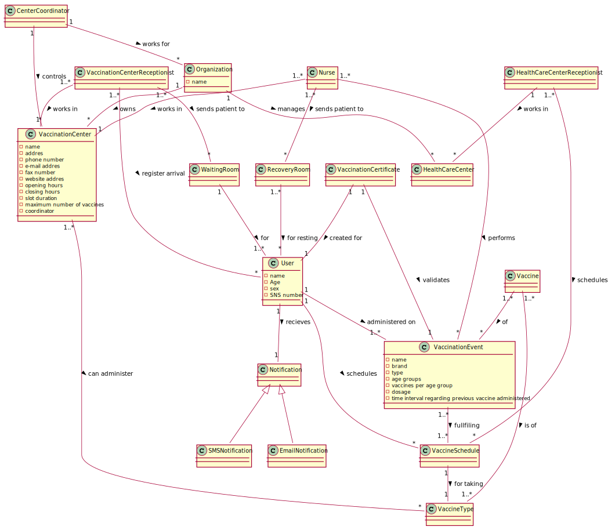

# OO Analysis #

The construction process of the domain model is based on the client specifications, especially the nouns (for _concepts_) and verbs (for _relations_) used. 

## Rationale to identify domain conceptual classes ##
To identify domain conceptual classes, start by making a list of candidate conceptual classes inspired by the list of categories suggested in the book "Applying UML and Patterns: An Introduction to Object-Oriented Analysis and Design and Iterative Development". 

### _Conceptual Class Category List_ ###

**Product/Service related to a Transaction or Transaction Line Item**

* Schedule vaccination event 
* Vaccination

---

**Roles of People or Organizations**

* Nurse
* Receptionist at vaccination center
* Receptionist at healthCare center
* Center Coordinator
* SNS User

---

**Places**

* Vaccination Center
* Waiting room
* Recovery Room
* HealthCare Center
* Vaccination room

---

**Noteworthy Events**

* Vaccination schedule
* Vaccination event
* Arrival of SNS User at Vaccination Center
* Notification recovery time over

---

**Physical Objects**

* Vaccine

---

**Descriptions of Things**

* Vaccine type

---

**Organizations**

* SNS

---

**Documents mentioned/used to perform some work/**

* Vaccination Certificate

---

###**Rationale to identify associations between conceptual classes** ###

An association is a relationship between instances of objects that indicates a relevant connection and that is worth of remembering, or it is derivable from the List of Common Associations: 

+ **_Organization_** owns **_Vaccination center_**
+ **_Organization_** manages **_HealthCare center_**
+ **_Center coordinator_** controls **_Vaccination center_**
+ **_Center coordinator_** works for **_Organization_**
+ **_Nurse_** works in **_Vaccination center_**
+ **_Nurse_** performs **_Vaccination event_**
+ **_Vaccination center receptionist_** works in **_Vaccination center_**
+ **_Vaccination center receptionist_** registers the arrival of **_SNS user_**
+ **_HealthCare center receptionist_** works in **_HealthCare center_**
+ **_HealtCare center receptionist_** schedules **_Vaccination event_**
+ **_Vaccination center receptionist_** sends patien to **_Waiting room_**
+ **_Vaccination event_** validated by **_Vaccination certificate_** 
+ **_Nurse_** sends patient to **_Recovery room_**
+ **_SNS User_** recivies **_Notification_**
+ **_Vaccination certificate_** for **_SNS user_**
+ **_Vaccine_** is of **_Vaccine type_**
+ **_Vaccine schedule_** for taking **_Vaccine type_** 
+ **_Waiting room_** for **_SNS user_**
+ **_Recovery room_** for **_SNS user_**
+ **_SNS user_** schedules **_VaccineSchedule_**
+ **_Vaccination event_** fullfiling **_Vaccination schedule_**
+ **_Vaccine_** of **_Vaccination event_**
+ **_Vaccination center_** can administer **_Vaccine type_**
+ **_Vaccination event_** administered to **_SNS user_**

| Concept (A) 		                  | Association   	  |             Concept (B) |
|---------------------------------|:----------------:|------------------------:|
| Organization 	                  |    owns    	     |      Vaccination center |
| Organization                    |     manages      |       HealthCare center |
| Center coordinator              |     controls     |      Vaccination center |
| Center coordinator              |    works for     |            Organization |
| Nurse                           |     works in     |      Vaccination center |
| Nurse                           |     performs     |       Vaccination event |
| Vaccination center receptionist |     works in     |      Vaccination center |
| Vaccination center receptionist | register arrival |                SNS user |
| HealthCare center receptionist  |     works in     |       HealthCare center |
| HealthCare center receptionist  |    schedules     |       Vaccination event |
| Vaccination center receptionist | sends patient to |            Waiting room |
| Vaccination event               |   validated by   | Vaccination certificate |
| Nurse                           | sends patient to |           recovery room |
| SNS user                        |     recieves     |            Notification |
| Vaccination certificate         |       for        |                SNS user |
| Vaccine                         |      is of       |            Vaccine type |
| Vaccine schedule                |    for taking    |            Vaccine type |
| Waiting room                    |       for        |                SNS user |
| Recovery room                   |       for        |                SNS user |
| SNS user                        |    Schedules     |      Vaccinete schedule |
| Vaccination event               |    fullfiling    |    Vaccination schedule |
| Vaccine                         |        of        |       Vaccination event |
| Vaccination center              |  can administer  |           Vaccinte type |
| Vaccination event               | administered to  |                SNS user |

## Domain Model

**Do NOT forget to identify concepts atributes too.**

