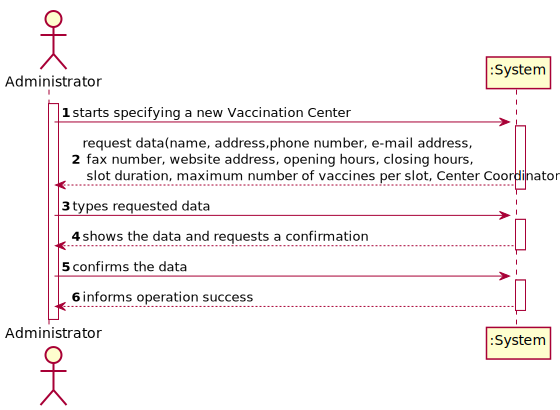
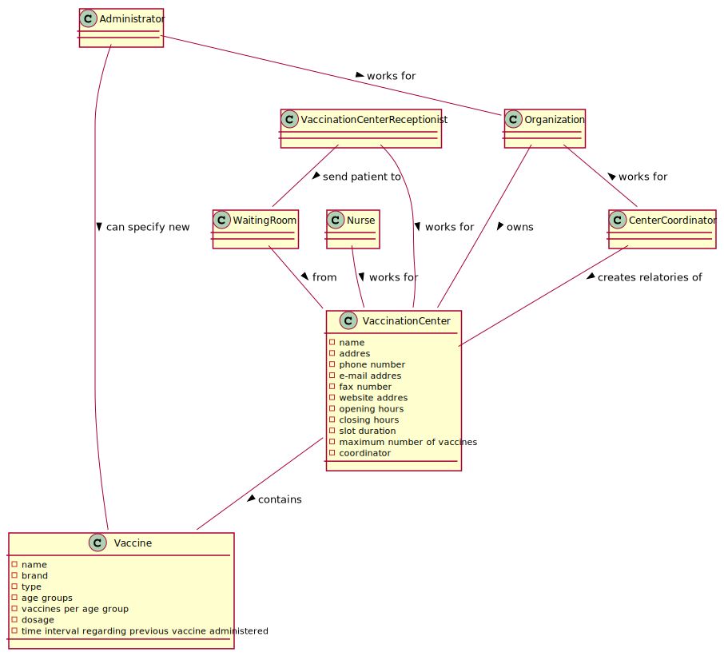
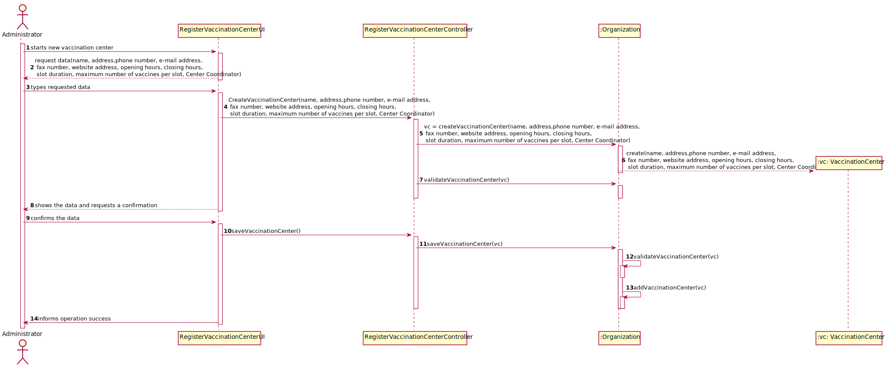
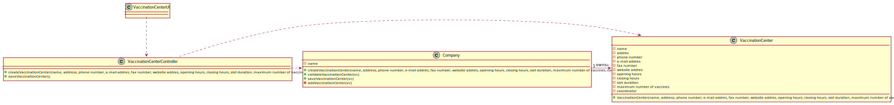

# US 009 - Register a Vaccination Center

## 1. Requirements Engineering

### 1.1. User Story Description

*As an administrator I want to register a new vaccination center to respond a certain pandemic.*

### 1.2. Customer Specifications and Clarifications

**From the specifications document:**

*  "[...] the community massvaccination centers are facilities specifically created to administer vaccines of a single type" *
*  "[...] vaccination centers are characterized by a name, an address, a phone number, an e-mail address, a fax number, a website address, opening and closing hours, slot duration (e.g.: 5 minutes) and the maximum number of vaccines that can be given per slot (e.g.: 10 vaccines per slot)." *
*  "In addition, each vaccination center has one coordinator" *

### 1.3. Acceptance Criteria

*Insert here the client acceptance criteria.*

### 1.4. Found out Dependencies

*No dependeces were founded.*

### 1.5 Input and Output Data

* Typed data:
    * name, 
    * address, 
    * phone number
    * e,mail address
    * fax number
    * website address 
    * opening hour
    * closing hour
    * slot duration
    * maximum number of vaccines per slot
    * Center Coordinator responsible
	
* Selected data:
    * (none) 

**Output Data:**

* (In)Success of the operation

### 1.6. System Sequence Diagram (SSD)

*Insert here a SSD depicting the envisioned Actor-System interactions and throughout which data is inputted and outputted to fulfill the requirement. All interactions must be numbered.*

### 1.7 Other Relevant Remarks

*(none)*

## 2. OO Analysis

### 2.1. Relevant Domain Model Excerpt 
*In this section, it is suggested to present an excerpt of the domain model that is seen as relevant to fulfill this requirement.* 

### 2.2. Other Remarks

*n/a*

## 3. Design - User Story Realization 

### 3.1. Rationale

**The rationale grounds on the SSD interactions and the identified input/output data.**

| Interaction ID | Question: Which class is responsible for... | Answer  | Justification (with patterns)  |
|:-------------  |:--------------------- |:------------|:---------------------------- |
| Step 1: Starts specifying a new Vaccination Center   | ..instanting a new Vaccination Center?			     | Company                        |         Creator: R1/2                                           |
| Step 2: request data 		                           |	n/a						                         |                                |                                                                 |
| Step 3: types requested data  		               | ... saving the input data							 | VaccinationCenter              |   IE: The object created in step 1 has its own data.            |
| Step 4: shows the data and request the confirmation  |	...validating the data locally?					 | Vaccination Center             |   IE: knows its own data                                        |
|   		                                           | ... validating the data globaly?  					 | Company                        |   IE: knows all the VaccinationCenter objects                                                              | 
| Step 5: confirms the data:  		                   | ... saving the created Vaccination Center?			 | Company                        |   IE: adopts/records all the VaccinationCenter objects                                                              |
| Step 6: informs operation success  		           | ... inform operation success?						 | RegisterVaccinationCenterUI    |   IE: responsible for user interaction                                                              |              

### Systematization ##

According to the taken rationale, the conceptual classes promoted to software classes are: 

 * Company
 * Vaccination Center

Other software classes (i.e. Pure Fabrication) identified: 
 * VaccinationCenterUI  
 * VaccinationCenterController

## 3.2. Sequence Diagram (SD)

*In this section, it is suggested to present an UML dynamic view stating the sequence of domain related software objects' interactions that allows to fulfill the requirement.* 

## 3.3. Class Diagram (CD)

*In this section, it is suggested to present an UML static view representing the main domain related software classes that are involved in fulfilling the requirement as well as and their relations, attributes and methods.*

# 4. Tests 
*In this section, it is suggested to systematize how the tests were designed to allow a correct measurement of requirements fulfilling.* 

**_DO NOT COPY ALL DEVELOPED TESTS HERE_**

**Test 1:** Check that it is not possible to create an instance of the Example class with null values. 

	@Test
    void validateVaccinationCenterTestNullParameters() {
        VaccinationCenter vc1 = new VaccinationCenter(null,null,null,null,null,null,null,null,0,0,new CenterCoordinator(null,null,999999999,null,9999999));
        boolean actual = company.validateVaccinationCenter(vc1);
        assertFalse(actual);
    }

# 5. Construction (Implementation)

## Class RegisterVaccinationCenterController
    public boolean createVaccinationCenter(String name, String address, String phoneNumber, String emailAddress, String faxNumber, String webSiteAddress, String openHour, String closeHour, int slotDuration, int maxVaccinePerSlot) {
        this.vc = this.company.createVaccinationCenter(name,address,phoneNumber,emailAddress,faxNumber,webSiteAddress,openHour,closeHour,slotDuration,maxVaccinePerSlot);
        return this.company.validateVaccinationCenter(vc);
    }

## Class Company
    public VaccinationCenter createVaccinationCenter(String name, String address, String phoneNumber, String emailAddress, String faxNumber, String webSiteAddress, String openHour, String closeHour, int slotDuration, int maxVaccinePerSlot) {
        return new VaccinationCenter(name,address,phoneNumber,emailAddress,faxNumber,webSiteAddress,openHour,closeHour,slotDuration,maxVaccinePerSlot);
    }

    

# 6. Integration and Demo
       
- A new option on the Admin menu was added

# 7. Observations

*In this section, it is suggested to present a critical perspective on the developed work, pointing, for example, to other alternatives and or future related work.*

